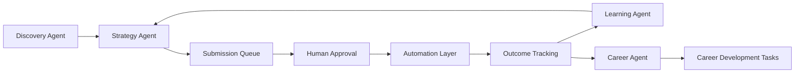
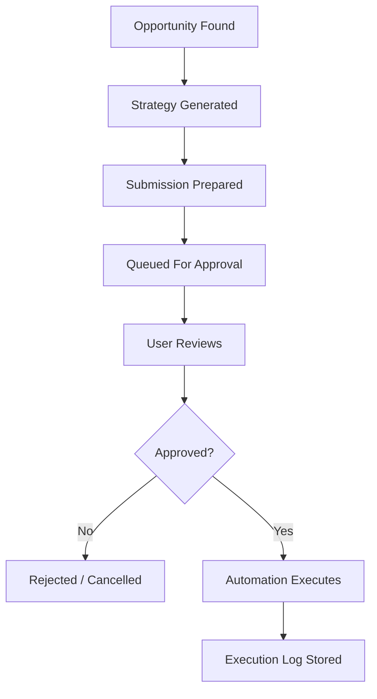
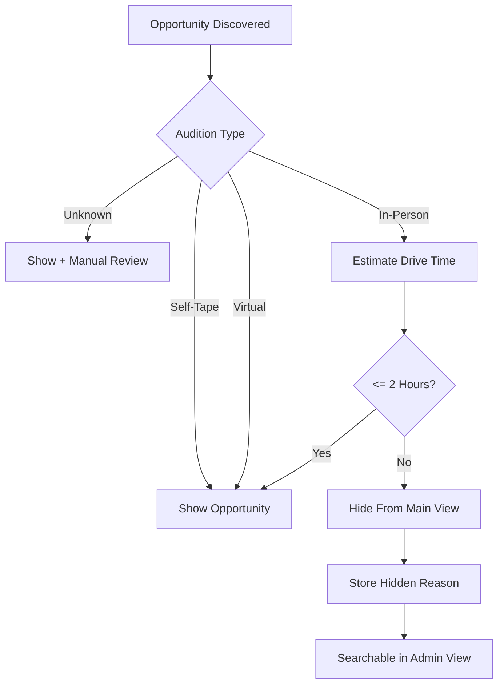
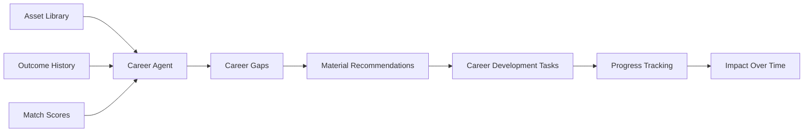
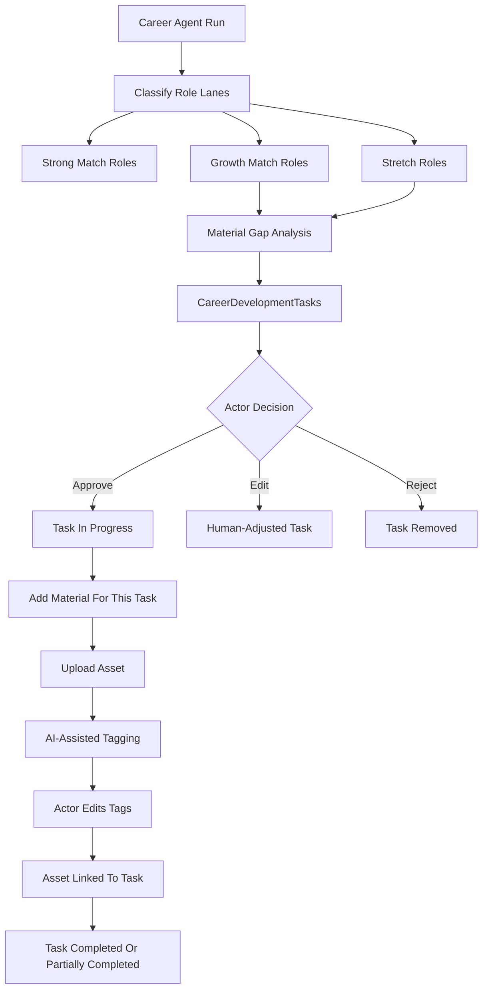
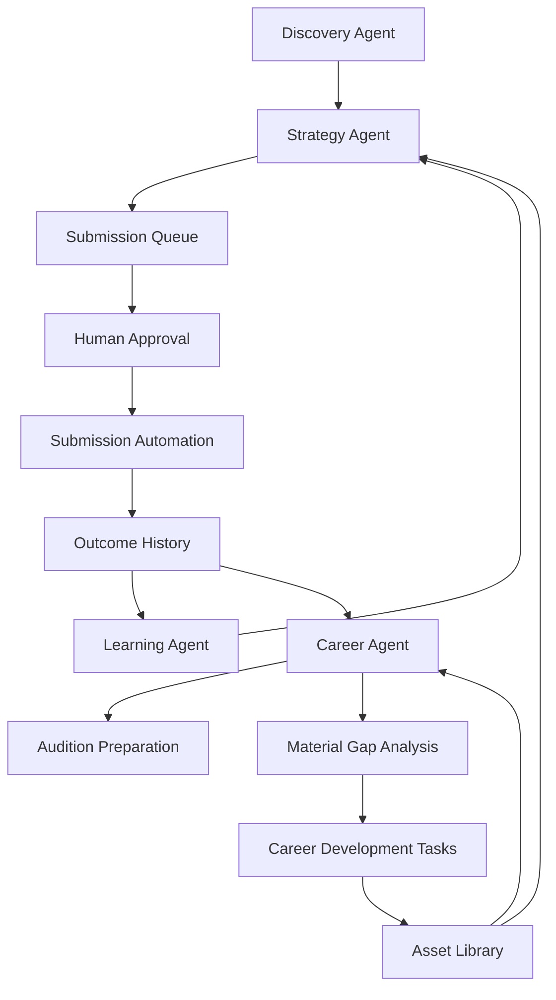
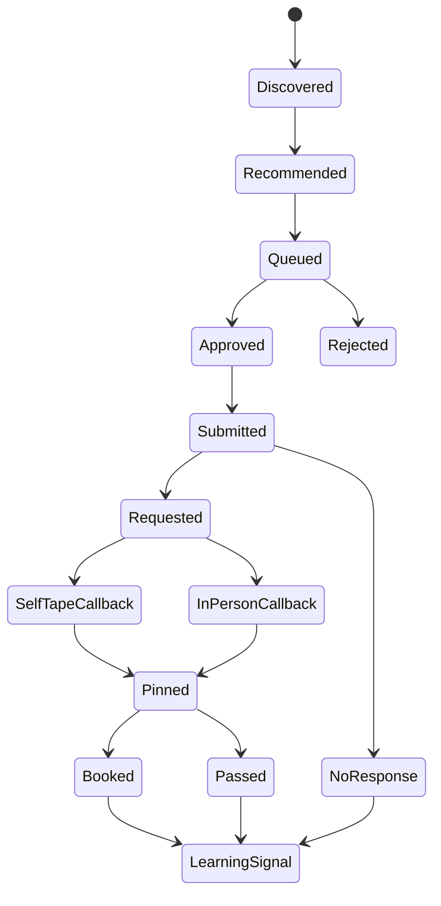
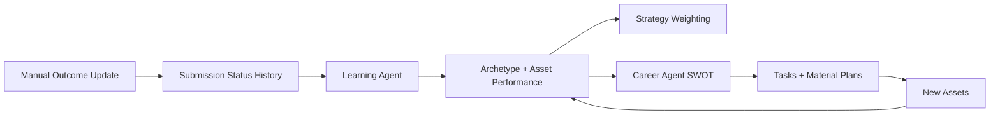
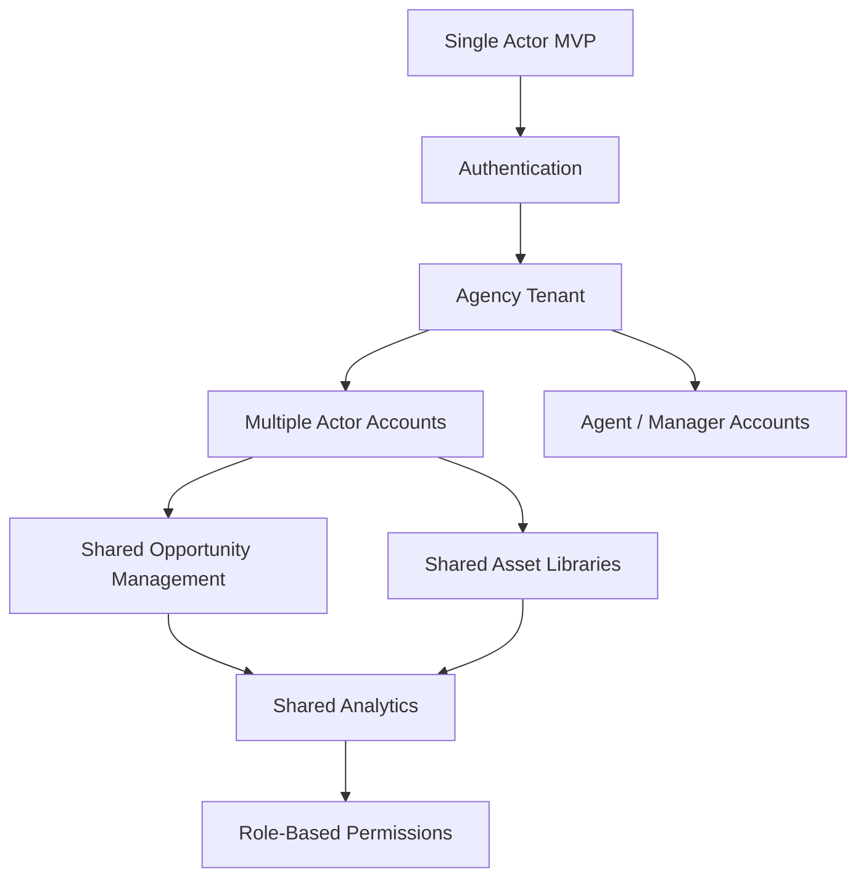
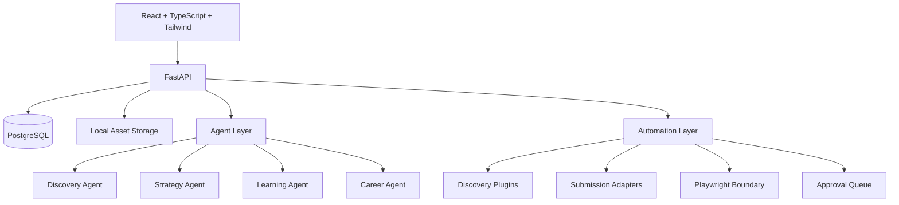

# The Working Actor OS

> **Portfolio deployment posture:** The deployed portfolio is a sanitized, single-actor demonstration, not a multi-user SaaS product. Authentication and authorization are not implemented. Its backend must use one explicitly configured frontend CORS origin; CORS limits browser origins but is not identity protection. Supervised browser automation is local-development-only, and external providers remain disabled in `portfolio_demo` mode. Use no real private actor data or production credentials in the public demo.

Your AI-powered career operating system.

The Working Actor OS helps actors manage breakdowns, auditions, materials, relationships, analytics, and career strategy in one AI-powered workspace.

## Portfolio release verification

Use Node `20.20.2` with npm 10+ and Python 3.12. Before a portfolio deployment, run:

```bash
cd frontend
nvm use
npm ci
npm test
npm run lint
npm run build
npm run test:e2e

cd ../backend
.venv/bin/python -m pytest
.venv/bin/python scripts/run_contract_smoke.py
```

GitHub Actions runs the same frontend unit, lint, build, and full Playwright checks, plus backend fast tests and guarded PostgreSQL contract smoke tests. Repository-wide Ruff lint and formatting have pre-existing debt and are not release gates yet; every Python file changed by a pull request must still pass `ruff check` and `ruff format --check`.

Deploy only sanitized demo data with `ENVIRONMENT=portfolio_demo`, one explicit `CORS_ORIGINS` frontend origin, `SUPERVISED_BROWSER_ENABLED=false`, and external web search, AI, routing, scheduling, notifications, public-profile URL imports, and real submission automation disabled. Verify host upload persistence separately before enabling upload workflows. Green CI is required but does not replace post-deployment health, route, API, and persistence smoke testing.

Built as a portfolio-grade demonstration of multi-agent orchestration, explainable AI decision-making, human-in-the-loop learning, and approval-gated automation.

## What It Does

The Working Actor OS helps a professional SAG-AFTRA actor manage the full casting workflow:

- Discover casting breakdowns from pluggable sources
- Normalize and deduplicate breakdowns
- Filter opportunities using audition feasibility rules
- Analyze role fit and archetype alignment
- Recommend headshots, reels, resumes, slates, and submission notes
- Explain every recommendation
- Queue submissions for human approval
- Track submission outcomes over time
- Learn from callbacks, pins, bookings, passes, and no-responses
- Surface **Your Casting Patterns** from the actor's own tracked breakdowns, auditions, submissions, callbacks, bookings, goals, archetypes, and materials
- Identify career gaps and stretch roles
- Create career development tasks for new materials and role expansion

The current implementation uses deterministic agents and mock-safe automation boundaries. It is designed so real AI model calls, real source integrations, and production browser automation can be added behind established interfaces.

## Why This Is An Agentic Engineering Project

This is not a chatbot wrapper. It is a workflow system with specialized agents, structured state, explainable decisions, feedback loops, and approval-gated automation.



## Core Agents

### Discovery Agent

Finds, normalizes, categorizes, deduplicates, and filters opportunities.

Source priority:

1. Actors Access
2. Casting Networks
3. Casting Frontier
4. Instagram
5. Facebook
6. Threads
7. LinkedIn
8. Production Websites
9. Google Search

Each source follows a plugin contract:

- `discover()`
- `normalize()`
- `deduplicate()`

### Strategy Agent

Analyzes whether an actor should submit and how.

It evaluates:

- Role fit
- Archetype fit
- Audition feasibility
- Production travel
- Asset package completeness
- Learning signals

It outputs:

- Match score
- Match type
- Score breakdown
- Recommended headshot
- Recommended reel
- Recommended resume
- Recommended slate
- Recommended note
- Full explanation

### Learning Agent

Learns from manually updated submission outcomes:

- Submitted
- Requested
- Self-Tape Callback
- In-Person Callback
- Pinned
- Booked
- Passed
- No Response

The system stores complete status history and converts outcomes into future recommendation signals.

### Your Casting Patterns

The app does not claim to measure full entertainment-industry trends. It shows staged, actor-specific patterns from the user's own tracked activity:

- **Early Signals:** at least 5 tracked breakdowns or auditions.
- **Emerging Patterns:** at least 10 tracked breakdowns/auditions or 3 submissions.
- **Stronger Patterns:** at least 20 tracked breakdowns/auditions or 5 submissions with outcomes.

Examples include which archetypes are appearing in the user's tracked roles, which audition formats are most common, which sources are producing activity, and which archetypes are connected to callbacks or bookings.

### Career Agent

Provides long-term career guidance and is the central differentiator of the project. It turns a submission tracker into an actor career intelligence system.

- Identifies overused archetypes
- Identifies underutilized archetypes
- Recommends Strong Match, Growth Match, and Stretch roles
- Finds material gaps for each growth or stretch lane
- Suggests new headshots and reel scenes
- Creates career development tasks
- Generates personal casting SWOT analysis
- Links recommended materials back to tasks and asset uploads
- Tracks progress over time

Example tasks:

- Create Attorney Reel Scene
- Create Political Leader Headshot
- Film Detective Self-Tape
- Update Resume With Procedural Drama Credit

Role definitions:

- **Strong Match:** aligned with existing bookings, callbacks, assets, and archetypes.
- **Growth Match:** adjacent to existing bookings, callback patterns, and asset coverage.
- **Stretch Role:** not strongly represented yet, but plausible based on playable age, type, existing archetypes, callback patterns, and career goals.

## Explainability

Every recommendation answers:

```text
Why was this recommended?
```

The explanation includes:

- Match score
- Score breakdown
- Audition decision
- Audition travel explanation
- Production travel explanation
- Archetype explanation
- Asset explanation
- Submission strategy explanation

## Human-In-The-Loop Automation

The system can prepare submissions, but it never auto-submits without approval.



## Discovery Filtering

The system separates audition feasibility from production travel.



## Career Development Intelligence

Career intelligence connects asset coverage, submission history, callbacks, bookings, archetype usage, material gaps, and growth strategy.





The dashboard supports:

- View career development tasks
- Approve agent-generated tasks
- Create task
- Edit task
- Complete task
- Reject/delete task
- Add material for a task
- Pre-fill tags and archetypes from the task
- Link uploaded assets back to tasks
- Filter by status
- Filter by archetype
- Filter by priority

The Career Agent also generates a personal casting SWOT:

- **Strengths:** e.g. authority roles perform well.
- **Weaknesses:** e.g. limited detective footage.
- **Opportunities:** e.g. procedural drama stretch roles.
- **Threats:** e.g. over-reliance on healthcare or parent roles.

## AI Intelligence Layer

The expanded intelligence layer makes the product useful beyond individual submissions.

- **Archetype Performance Dashboard:** submissions, callbacks, pins, bookings, passes, no responses, callback rate, and booking rate.
- **Casting Office Intelligence:** callback and booking rates by casting office, best-performing materials by office, and stretch-response signals.
- **Role Similarity Engine:** suggests roles adjacent to past callbacks and bookings.
- **Audition Preparation Agent:** generates structured audition briefs with character analysis, objectives, obstacles, tone, wardrobe, research, comparables, self-tape notes, and questions.
- **Material Recommendation Generator:** turns missing assets into scene concepts, wardrobe, tone, conflicts, comparables, supported roles, and explanation.
- **Career Path Simulator:** creates explainable two-year career strategy grounded in assets, submissions, callbacks, bookings, and stretch goals.









## Architecture



## Tech Stack

### Frontend server state

TanStack Query is the authoritative server-state layer. Features read server data through public query boundaries; the application shell does not maintain a global server snapshot or workflow loader. React Query must not be used as a second copy of local UI state.

- Server state is data read from or written to the backend. Feature query and mutation hooks belong in `frontend/src/features/<feature>/hooks/` and call that feature's public API module.
- Query keys are centralized in `frontend/src/services/api/queryKeys.ts`. Feature hooks use these factories instead of declaring string arrays in components.
- Each query hook chooses an appropriate stale-time tier from `frontend/src/services/api/queryPolicy.ts`: live data (15 seconds), workflow records (1 minute), reference data (5 minutes), or configuration data (10 minutes).
- Successful mutations invalidate the narrowest affected feature key. Cross-feature invalidation uses the other feature's public key factory and must be intentional. Failed mutations preserve `ApiError`; presentation code shows a safe message rather than raw response data.
- Form drafts, expanded rows, tabs, modal state, drag-and-drop state before save, and transient selections remain local React state.
- Redux is not being added because React Query owns remote server state and React already owns the current local UI state. A separate global client-state store is not justified.

Calendar uses independent full-list queries for events and availability because the backend endpoints do not accept visible-date-range filters. FullCalendar event objects remain presentation adapters; API date/time strings, including explicit offsets and local `datetime-local` values, are passed through without silent UTC conversion.

Calendar editing is intentionally form-based. Unlinked Calendar-owned records can be renamed or deleted through Calendar controls. Linked workflow rows and projections of Auditions self-tapes/callbacks, Breakdown deadlines/shoot dates, and Chief of Staff platform reminders are read-only in Calendar and must be changed in their owning feature. Drag, resize, and timed/all-day conversion are unsupported because the Calendar record contract does not carry reliable source provenance or an all-day field, and derived deadlines must not become independently editable copies. Drag interaction may be reconsidered only after canonical owner mutations, provenance, timezone, duration, and keyboard-equivalent semantics are defined.

Cross-feature invalidation contracts live in `frontend/src/services/api/invalidationContracts.ts`. The mutation-owning feature invalidates stable public keys only when the backend synchronously changes that record or a proven derived read. The registry records direct, derived, and forbidden caches; it is review metadata, while mutation hooks retain explicit behavior. In particular:

| Mutation | Proven derived invalidation | Explicitly excluded |
| --- | --- | --- |
| Submission create | persisted Calendar events, actor Journal, Auditions notes, opportunity/readiness, relationships, material usage, submission-based Analytics, command center | Dashboard preferences, executive briefs, industry trends |
| Submission status/outcome | actor Journal for meaningful outcomes, opportunity/readiness, relationships, submission-based Analytics, command center | Calendar rows, Auditions notes, executive briefs |
| Notes-only submission update | none beyond submissions | Analytics, Calendar, Journal |
| Callback change | callback owner cache; linked submission/actor Journal/derived metrics where applicable | persisted Calendar rows; Calendar projects the callback cache |
| Workflow self-tape change | command center and actor Journal on completion | persisted Calendar rows; Calendar projects the self-tape cache |
| Career task change | command center and actor Journal on completion | executive briefs and Dashboard preferences |
| Platform check-in | command center and actor Journal when checked | persisted Calendar rows and executive briefs |
| Calendar event change | operations dashboard | Auditions, Breakdowns, and Dashboard preferences |
| Submission queue execution | queue only | local submissions and downstream aggregates; the adapter records execution but creates no local Submission |

Invalidation is background cache maintenance. A successful mutation remains successful if a derived refetch fails; the derived feature owns its query error and retry UI. Dashboard continues to compose authoritative public feature queries and has no general Dashboard data cache.

The Step 48 freshness checkpoint moved Analytics intelligence, Analytics material performance, and actor Journal history to stale-time-aware remount behavior. Their synchronous writers now have explicit public-key invalidation, so a fresh immediate return reuses cached data and a stale return refetches after the one-minute workflow window. Operational Analytics remains forced because alerts and deadlines change with wall-clock time.

Forced route-entry freshness remains for command center, Calendar, Auditions workflow records, Breakdowns discovery/readiness/queue state, Career records, Source Library, executive briefs, availability, and import processing. These resources are live, externally mutable, or can be generated without a completion/version signal. The backend exposes no general generation job contract for agent-created Career records, executive briefs, discovery/source changes, or external platform outcomes; no polling was introduced. Calendar remains form-based and retains its intentional live refresh.
- Query-hook tests use `createTestQueryClient` and `createTestQueryWrapper` from `frontend/src/test/testUtils.tsx`. Every test receives an isolated cache with retries disabled.
- Pages remain thin composition layers, feature hooks call their own API modules, and components never construct query clients or declare ad hoc query keys. The single production QueryClient is infrastructure-owned. Route queries own their loading and error states without blocking the application shell.
- Cross-feature invalidation uses shared key factories, never another feature's internal hooks. It is added only when the initiating mutation is known to change the other feature's backend records.

### Critical browser tests

Run the deterministic Chromium suite from `frontend/` with `npm run test:e2e`. The suite starts a local Vite server and intercepts every `/api/v1` request with isolated in-memory fixtures, so it never contacts the developer database, casting platforms, public websites, AI providers, routing providers, or email services. Install the browser runtime once with `npx playwright install chromium`.

The suite covers application boot, partial route failure, Breakdown-to-Auditions propagation, Auditions-to-Calendar deadlines, Materials and Profile public consumers, Dashboard preferences, reusable versus workflow self-tape separation, and the intentionally form-only Calendar interaction contract. Chromium runs in `America/New_York` and includes DST-sensitive Calendar values.

### Real-backend contract smoke tests

From `backend/`, run `.venv/bin/python scripts/run_contract_smoke.py`. The runner creates a temporary PostgreSQL cluster and the `working_actor_os_contract_test` database on a random local port, applies all Alembic migrations, disables external providers, runs the focused real-HTTP contract suite, and removes the cluster afterward. Destructive setup is refused unless the database name contains `test` and `ALLOW_TEST_DATABASE_RESET=true`; never point the command at development data.

Backend:

- Python
- FastAPI
- SQLAlchemy
- Alembic
- PostgreSQL
- Pydantic

Frontend:

- React
- TypeScript
- Vite
- Tailwind

Automation:

- Playwright-ready abstraction
- Mock discovery plugins
- Mock submission adapters

Storage:

- PostgreSQL
- Local file storage for actor assets

## Project Structure

```text
backend/
  app/
    agents/
    automation/
      discovery/
      playwright/
      queue/
      submission/
    api/v1/routes/
    db/models/
    repositories/
    schemas/
    services/
  alembic/
frontend/
  src/
    api/
    components/
    types/
outputs/
  system-design-documentation.md
  agent-architecture-documentation.md
  scaling-roadmap.md
  agency-mode-roadmap.md
  production-deployment-roadmap.md
  portfolio-case-study.md
```

## Documentation

- [System Design Documentation](outputs/system-design-documentation.md)
- [Agent Architecture Documentation](outputs/agent-architecture-documentation.md)
- [Scaling Roadmap](outputs/scaling-roadmap.md)
- [Agency Mode Roadmap](outputs/agency-mode-roadmap.md)
- [Production Deployment Roadmap](outputs/production-deployment-roadmap.md)
- [Portfolio Case Study](outputs/portfolio-case-study.md)

## Backend Setup

Requirements:

- Python 3.12+
- PostgreSQL

Create a database:

```bash
createdb casting_intelligence
```

Install and run:

```bash
cd backend
python -m venv .venv
source .venv/bin/activate
pip install -e .
cp .env.example .env
alembic upgrade head
uvicorn app.main:app --reload
```

API docs:

- `http://localhost:8000/docs`
- `http://localhost:8000/health`

## Frontend Setup

Requirements:

- Node.js 20 LTS. The project pins `20.20.2` in `.nvmrc` and `.node-version`.
- npm 10+

Recommended macOS setup:

```bash
nvm install
nvm use
cd frontend
npm ci
cp .env.example .env
npm run build
npm run dev
```

If you do not use `nvm`, install a Node version matching `.node-version` with your preferred version manager, then run the same `npm ci` and `npm run build` commands from `frontend/`.

Development server:

```bash
cd frontend
npm ci
cp .env.example .env
npm run dev
```

Frontend:

- `http://localhost:5173`

## API Highlights

Base path:

```text
/api/v1
```

Agents:

- `POST /agents/discovery/run`
- `POST /agents/opportunities/{opportunity_id}/recommend`
- `GET /agents/recommendations`
- `GET /agents/recommendations/{recommendation_id}/explanation`
- `POST /agents/learning/run`
- `POST /agents/career/run`

Automation:

- `GET /automation/discovery/plugins`
- `POST /automation/discovery/run`
- `GET /automation/opportunities/hidden`
- `GET /automation/submission-queue`
- `POST /automation/submission-queue/from-recommendation/{recommendation_id}`
- `POST /automation/submission-queue/{queue_id}/approve`
- `POST /automation/submission-queue/{queue_id}/execute`

Career development:

- `GET /career-development/tasks`
- `POST /career-development/tasks`
- `PATCH /career-development/tasks/{task_id}`
- `POST /career-development/tasks/{task_id}/complete`
- `DELETE /career-development/tasks/{task_id}`

## Agency Mode Expansion

The system is intentionally structured to evolve from single actor mode into a multi-actor agency platform.

Planned additions:

- Authentication
- Multi-tenancy
- Actor accounts
- Agent accounts
- Role-based permissions
- Shared opportunity management
- Shared analytics
- Shared asset libraries

See [Agency Mode Roadmap](outputs/agency-mode-roadmap.md).

## Production Roadmap

Planned production hardening:

- Containerized backend
- Managed PostgreSQL
- Object storage
- Background workers
- Scheduled discovery
- OpenAI structured outputs
- Observability
- Tenant-aware authorization
- Cost controls

See [Production Deployment Roadmap](outputs/production-deployment-roadmap.md).

## Portfolio Narrative

This project demonstrates how to build agentic systems that are more than prompt calls:

- Agents own distinct responsibilities.
- State is structured and auditable.
- Decisions are explainable.
- Automation is approval-gated.
- Feedback loops improve future recommendations.
- Career intelligence creates long-range planning value.

It is designed to be understandable to engineering hiring managers, AI startups, product leaders, and technical recruiters as a practical example of agentic engineering applied to a real workflow.
