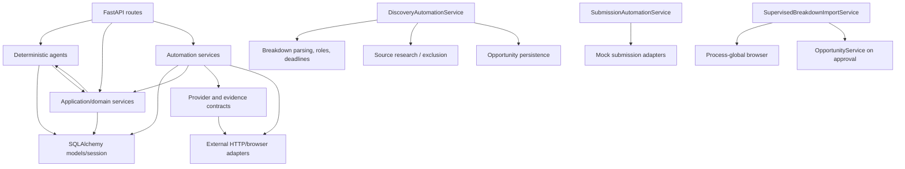

# Phase 2 Backend Architecture Audit

**Branch:** `release/portfolio-readiness`  
**Audit date:** 2026-07-26  
**Scope:** `backend/app`, relevant backend tests, and selected Alembic migrations needed to establish domain and data ownership.  
**Constraint:** Evidence-based audit only. No production code was changed.

## Audit method

This audit traced the FastAPI entry point and every v1 route module into services, repositories, agents, automation, schemas, and SQLAlchemy models. It inspected all service and agent modules, discovery/submission/supervised-import automation, repository usage, commit/flush/rollback sites, external HTTP and filesystem boundaries, model relationships, relevant unit and PostgreSQL contract tests, and the migration sequence where it clarifies current ownership.

“Confirmed” means the behavior is directly visible in code or tests. “Strong inference” means the structure creates a clear risk whose production effect depends on workload or deployment. “Needs verification” is reserved for runtime or operational intent not provable from the repository.

## Executive assessment

The backend is a pragmatic service-centered FastAPI application, not a strict controller → service → repository system. That is not inherently a defect. Most routes are thin, Pydantic response models prevent accidental unfiltered ORM serialization, deterministic domain engines are well tested, and the most consequential multi-record workflows have unusually good PostgreSQL rollback characterization.

The principal risks are concentrated in five areas:

1. `OpportunityService.list` and `get` repair and commit data during reads;
2. transaction ownership varies among routes, services, agents, and automation;
3. several large services combine application orchestration, persistence, transport integration, and policy;
4. discovery and supervised imports reproduce parts of the opportunity-ingestion pipeline instead of using one transaction-neutral ingestion boundary;
5. the supervised browser is process-global and local filesystem/browser resources are not deployment-safe multi-user abstractions.

No critical defect was confirmed. Two high-severity findings should be addressed or explicitly constrained before a public deployment: read-side database writes and the process-global supervised-browser controller. Most other work should be bounded and behavior preserving.

## 1. What is already strong

### 1.1 Entry, request scoping, and API serialization

- `backend/app/main.py:9` defines one FastAPI application; `main.py:20-25` exposes `/health` and mounts `/api/v1`.
- `backend/app/api/v1/router.py:23-48` explicitly registers 17 route groups.
- `backend/app/core/database.py:14-23` provides one engine/session factory and closes one SQLAlchemy `Session` per request.
- `backend/app/schemas/common.py:7-9` enables `from_attributes` through `TimestampedModel`; routes normally declare concrete Pydantic response models.
- No route was found returning an undeclared ORM model through a generic catch-all response contract for core CRUD resources. ORM objects are returned internally, but FastAPI serializes them through declared schemas.

### 1.2 Core opportunity writes have an explicit unit of work

- `OpportunityService.create`, `update`, `parse_breakdown_text`, `deep_parse`, and `approve_as_acting_breakdown` coordinate parsing, roles, eligibility, trust, workflows, journal/calendar effects, and a final commit.
- Collaborators such as `BreakdownIntelligenceEngine.run_for_opportunity`, `BreakdownRoleService.sync_from_details`, `CharacterIntelligenceEngine.run_for_opportunity`, `ActorWorkEventService`, and `ManualOverrideService` generally flush or add without committing. This permits the owning service to commit the aggregate workflow once.
- `backend/tests/contract_smoke/test_contract_smoke.py` protects opportunity-create and deep-parse atomic rollback, downstream workflow creation, visibility rules, and delete protection.
- Migration `0054_protect_submitted_opportunities.py` and `OpportunityService.delete` jointly protect submitted opportunities from destructive deletion.

### 1.3 Discovery and source-exclusion transactions are deliberately tested

- `DiscoveryAutomationService.run_source` records a run, rolls back partial provider/opportunity writes on failure, persists a failed-run record separately, and keeps the original exception primary.
- `backend/tests/contract_smoke/test_discovery_run_transactions.py` verifies provider exceptions, database failures, commit-time failures, failure-reporting failures, and the one-commit success path against PostgreSQL.
- `SourceExclusionService` uses PostgreSQL upsert/update primitives and leaves commit ownership to its caller.
- `SourceExclusionGate` separates evidence eligibility from persistence mechanics.
- `test_source_exclusion_gate.py` and `test_source_exclusions.py` explicitly assert caller rollback behavior, version changes, expiry, reactivation, and concurrency-sensitive contracts.

### 1.4 Deterministic policy engines are independently testable

- `BreakdownDetailsService`, `BreakdownDeadlineService`, `CastingLanguageParser`, `CompatibilityEngine`, `DemographicMatchService`, and most of `CharacterIntelligenceEngine` expose deterministic behavior.
- Focused tests cover classification, eligibility, deadlines, casting language, character intelligence, compatibility, source identity/evidence, and trust verification.
- The current “agent” classes do not conceal an external LLM client. They are deterministic rule/data processors, consistent with `README.md`.

### 1.5 High-risk automation is approval gated

- `SubmissionAutomationService.queue_from_recommendation`, `approve`, `reject`, and `execute` make approval state explicit.
- `SubmissionAdapterRegistry` chooses named mock adapters.
- `PlaywrightAutomationService` documents and implements mock-only execution, including a pause-before-final-submit step.
- Supervised breakdown imports persist a staging record and require explicit approval before creating an opportunity.

## 2. Fifteen largest backend Python files

Counts include production Python under `backend/app` and exclude tests and migrations.

| Rank | File | Lines | Architectural observation |
|---:|---|---:|---|
| 1 | `backend/app/services/intelligence_service.py` | 1,620 | Many distinct intelligence CRUD, analytics, research, simulation, and planning domains |
| 2 | `backend/app/automation/discovery/service.py` | 1,359 | Discovery application service, persistence owner, reporting, filtering, and provider synchronization |
| 3 | `backend/app/services/source_research_service.py` | 1,018 | Source lifecycle, health, search, verification, policy, and provider synchronization |
| 4 | `backend/app/services/platform_import_service.py` | 864 | URL/upload parsing, staging, approval, mappings, assets, credits, and profile mutation |
| 5 | `backend/app/services/breakdown_details_service.py` | 728 | Large but mostly pure parsing/rule engine |
| 6 | `backend/app/services/opportunity_intelligence_service.py` | 618 | Cross-domain opportunity eligibility/enrichment coordinator |
| 7 | `backend/app/services/demographic_match_service.py` | 545 | Dense deterministic demographic policy |
| 8 | `backend/app/services/travel_service.py` | 505 | Provider adapters, HTTP, selection, caching, and persistence |
| 9 | `backend/app/services/character_intelligence_engine.py` | 466 | Character derivation plus ORM synchronization |
| 10 | `backend/app/schemas/intelligence.py` | 462 | Transport contracts for several separate intelligence subdomains |
| 11 | `backend/app/automation/discovery/public_web_search.py` | 458 | Search-provider integration, normalization, and parsing |
| 12 | `backend/app/services/operations_service.py` | 450 | Calendar, availability, equipment, subscriptions, and check-ins |
| 13 | `backend/app/services/resume_pdf_service.py` | 420 | PDF/DOCX rendering and generated-asset persistence |
| 14 | `backend/app/services/opportunity_service.py` | 418 | Opportunity aggregate/application orchestration |
| 15 | `backend/app/api/v1/routes/intelligence.py` | 409 | Large but predominantly delegating route surface |

File size alone is not treated as a boundary violation. `BreakdownDetailsService`, for example, is large but cohesive and mostly pure; `IntelligenceService` spans demonstrably separate resource lifecycles.

## 3. Route → service → repository flow map

| Route group | Actual application boundary | Persistence path |
|---|---|---|
| `actor_profiles.py` | `ActorProfileService` | `ActorProfileRepository`, plus direct opportunity scan in the service |
| `assets.py` | `AssetService`; `AssetAnalysisAgent` for analysis | `AssetRepository`; agent writes ORM directly |
| `opportunities.py` | `OpportunityService`, `MaterialMatchService`, `StrategyAgent`, executive/demographic services | `OpportunityRepository` for core CRUD; direct ORM in collaborators |
| `submissions.py` | `SubmissionService` | `SubmissionRepository` plus direct status/assets queries |
| `travel_preferences.py` | Route handler itself | `TravelPreferenceRepository`; route commits |
| `agents.py` | Agents, `ExecutiveIntelligenceService`, `SubmissionService`, `WatchListService`, workflow services | Extensive direct ORM in route and agents |
| `automation.py` | Discovery, source research, opportunity intelligence, submission automation | Direct ORM in automation/services; no discovery repository |
| `supervised_breakdowns.py` | `SupervisedBreakdownImportService` | Direct ORM plus `OpportunityService` on approval |
| `career_development.py` | Route handler itself plus `ActorWorkEventService` | Direct ORM; route commits |
| `command_center.py` | `CommandCenterService` for reads/refresh; route for nudges/self-tapes | Direct ORM in both route and service |
| `dashboard.py` | `DashboardService` | Direct ORM in service |
| `intelligence.py` | `IntelligenceService` | Direct ORM in service |
| `operations.py` | `OperationsService` | Direct ORM in service |
| `platform_imports.py` | `PlatformImportService` | Direct ORM and filesystem/HTTP |
| `representation.py` | `RepresentationService` | Direct ORM and generated-file services |
| `journal.py` | `JournalService` | Direct ORM in service |
| `system.py` | `CapabilityService` | Read-only direct ORM aggregation |

**Confirmed dependency direction:** routes depend on schemas and application services; services/agents/automation depend directly on ORM models; only five aggregates have repositories. Repositories are a selective CRUD convenience, not a universal persistence layer.

## 4. Agent and automation dependency map

Important cycles are conceptual rather than Python import cycles:

- services invoke agents (`ExecutiveIntelligenceService` → `ExecutiveAgent`, `WorkflowConnectorService` → `LearningAgent`);
- agents invoke services (`StrategyAgent` → `BreakdownDeadlineService`, `ExecutiveAgent` → `OperationsService`);
- discovery automation invokes domain services and writes the same opportunity models those services own.

No confirmed import-time circular dependency was found, but bidirectional layer dependence makes future cycles easier to introduce.

## 5. Detailed findings

### B-01 — Opportunity read operations mutate and commit persisted state

- **Severity:** high
- **Confidence:** confirmed
- **Exact paths and symbols:** `backend/app/services/opportunity_service.py`, `OpportunityService.list` and `OpportunityService.get`; `BreakdownDeadlineService.apply_to_opportunity`; `TrustVerificationService.verify`; `BreakdownRoleService.sync_from_details`; `CharacterIntelligenceEngine.run_for_opportunity`.
- **Current responsibility:** list/get both retrieve opportunities and repair deadlines, trust metadata, parsed details, roles, and character profiles, committing when repairs occur.
- **Responsibility it should ideally own:** query operations should retrieve/filter a stable read model; migrations, explicit maintenance commands, or write workflows should perform repair/backfill.
- **Why the current design may be risky:** a GET can lock/write rows, fail for write reasons, change visibility, create child records, and produce load-dependent latency. Repeated reads can race, and replicas/read-only database credentials would be unsafe.
- **Smallest safe improvement:** first add characterization tests for a stale legacy row. Then move one repair category at a time behind an explicit maintenance/application command while retaining a temporary compatibility fallback with metrics.
- **Tests protecting the behavior:** `backend/tests/contract_smoke/test_contract_smoke.py` exercises opportunity list/detail shapes and enriched records; deadline, details, character, and trust tests protect individual repairs. No test explicitly declares GET-side persistence as required.
- **Migration or data risks:** high. Existing rows may rely on lazy repair after migrations 0023-0032, 0039-0042, and 0046-0048 added derived fields and child tables.
- **Deployment timing:** fix or explicitly constrain before deployment. At minimum document that reads require write access and run an explicit backfill/preflight.

### B-02 — Transaction ownership is inconsistent across routes, services, agents, and automation

- **Severity:** high
- **Confidence:** confirmed
- **Exact paths and symbols:** `backend/app/core/database.py:get_db`; commits in `ActorProfileService`, `AssetService`, `SubmissionService`, `IntelligenceService`, `OperationsService`, agents, and route modules; transaction-neutral collaborators such as `ActorWorkEventService`, `WorkflowConnectorService`, `BreakdownRoleService`, and `SourceExclusionService`.
- **Current responsibility:** the method that happens to expose a user action usually commits, but some route handlers commit, most services commit, all stateful agents commit, and some lower-level services deliberately do not.
- **Responsibility it should ideally own:** one application-level use case should own commit/rollback; domain calculators and repositories should mutate/flush without finalizing the transaction.
- **Why the current design may be risky:** nested composition can commit earlier than the outer workflow expects, making later failure non-atomic. Callers cannot infer transaction behavior from layer or naming.
- **Smallest safe improvement:** document a transaction contract per public method now. For each newly touched multi-step workflow, introduce a non-committing internal method and keep the existing committing wrapper for compatibility.
- **Tests protecting the behavior:** opportunity/deep-parse/feedback rollback tests and `test_discovery_run_transactions.py` strongly protect selected units of work. Most ordinary CRUD services have behavior tests but no commit-count contract.
- **Migration or data risks:** medium-high; changing commit placement can expose flush-order, uniqueness, and cascade assumptions.
- **Deployment timing:** address the highest-risk composed workflows before deployment; defer a repository-wide unit-of-work conversion.

### B-03 — Several route modules still own business and persistence logic

- **Severity:** medium
- **Confidence:** confirmed
- **Exact paths and symbols:** `backend/app/api/v1/routes/career_development.py:validate_task_values`, task CRUD/complete handlers; `routes/travel_preferences.py:upsert_travel_preference` and `update_travel_preference`; `routes/agents.py:create_recommendation_feedback`, casting-goal CRUD, career SWOT creation; `routes/command_center.py:resolve_outcome_nudge`, self-tape create/update; `routes/automation.py:recalculate_travel_exceptions` and `list_hidden_opportunities`.
- **Current responsibility:** handlers validate lifecycle rules, query/update ORM objects, orchestrate cross-domain effects, and commit.
- **Responsibility it should ideally own:** HTTP parsing, dependency acquisition, response mapping, and translation of typed application errors.
- **Why the current design may be risky:** rules cannot be reused consistently outside HTTP, transaction policies differ from adjacent service-backed endpoints, and route tests become the only realistic coverage.
- **Smallest safe improvement:** when a handler next changes, move its existing body unchanged into a narrowly named application service; do not create repositories solely for symmetry.
- **Tests protecting the behavior:** career development, command-center/self-tape, travel, cross-module, and contract-smoke tests cover portions of these flows.
- **Migration or data risks:** low-to-medium if extraction preserves the same session and commit point.
- **Deployment timing:** fix only the route workflows involved in other pre-deployment changes; defer mechanical extraction of all CRUD.

### B-04 — `IntelligenceService` is several domains under one class

- **Severity:** medium
- **Confidence:** confirmed
- **Exact paths and symbols:** `backend/app/services/intelligence_service.py` (1,620 lines), `IntelligenceService`; casting offices/contacts, relationships, self-tapes, audition journal, callbacks, communication logs, preparation, material plans, scripts/scenes, simulations, reviews, targets, analytics.
- **Current responsibility:** CRUD, analytics, scoring, external script retrieval, workflow connections, and commits for many resource families.
- **Responsibility it should ideally own:** a coherent intelligence application facade or one bounded resource family—not all independent lifecycle owners.
- **Why the current design may be risky:** unrelated changes collide; the class has dozens of ORM dependencies and commit sites; script HTTP failures and relationship CRUD share one test/change surface.
- **Smallest safe improvement:** do not split by line count. First extract the external script-source adapter or material-plan lifecycle behind the existing facade while preserving public methods.
- **Tests protecting the behavior:** audition readiness, career intelligence UI, casting patterns, relationships, script-scene finder, and contract smoke.
- **Migration or data risks:** medium-high because `db/models/intelligence.py` and migrations 0007, 0010, 0011, 0035, and 0050-0053 span these resources.
- **Deployment timing:** defer broad splitting; isolate only external I/O or a currently changing lifecycle before deployment.

### B-05 — Discovery automation is oversized, but its transactional boundary is intentional

- **Severity:** medium
- **Confidence:** confirmed
- **Exact paths and symbols:** `backend/app/automation/discovery/service.py` (1,359 lines), `DiscoveryAutomationService.run_all`, `run_source`, `_create_opportunity`, `_run_public_web_search`, `_suggest_source_from_public_breakdown`, reporting/filtering/settings helpers.
- **Current responsibility:** provider registry/settings, source eligibility, external search, opportunity persistence/enrichment, source suggestions, reporting, transaction recovery, and plugin synchronization.
- **Responsibility it should ideally own:** discovery use-case orchestration and its unit of work; provider transport and deterministic policy should remain collaborators.
- **Why the current design may be risky:** one change can affect ingestion, provider health, visibility, source research, and failure recovery. Extraction that accidentally introduces a nested commit would break its strongest guarantee.
- **Smallest safe improvement:** preserve `run_source` as transaction owner. Extract one pure reporting/filtering collaborator or a non-committing opportunity-ingestion collaborator with the existing transaction tests unchanged.
- **Tests protecting the behavior:** discovery mode/classification/source-separation tests, public-web-search tests, contract smoke, and especially `test_discovery_run_transactions.py`.
- **Migration or data risks:** high for opportunity/run/source records; migrations 0004, 0021, 0025-0034, 0046-0047, 0052, and 0055 encode accumulated discovery behavior.
- **Deployment timing:** defer structural splitting unless needed for a concrete defect.

### B-06 — Discovery and supervised imports duplicate opportunity-ingestion rules

- **Severity:** medium
- **Confidence:** confirmed
- **Exact paths and symbols:** `DiscoveryAutomationService._create_opportunity` and `_ensure_details`; `SupervisedBreakdownImportService._parse_breakdown`, `_payload_from_parsed`, and `approve_import`; `OpportunityService.create`; shared parsing/role/deadline services.
- **Current responsibility:** three entry paths independently assemble opportunity defaults, parsing, classification, details, roles, trust, visibility, and side effects.
- **Responsibility it should ideally own:** one transaction-neutral ingestion pipeline should apply common opportunity invariants, while each caller owns source-specific staging and final commit.
- **Why the current design may be risky:** new invariants can be added to manual creation but omitted from discovery or supervised approval. Calling `OpportunityService.create` directly is not a safe fix because it commits internally.
- **Smallest safe improvement:** characterize equivalent inputs across all three paths; then extract only the shared non-committing invariant application behind existing public methods.
- **Tests protecting the behavior:** opportunity contract smoke, breakdown classification/details/eligibility tests, discovery tests, and supervised-import contract/UI tests.
- **Migration or data risks:** high because older records may encode different source-specific defaults.
- **Deployment timing:** document before deployment; implement only after equivalence tests exist.

### B-07 — Repository usage is selective and bypassed by design, but the contract is undocumented

- **Severity:** medium
- **Confidence:** confirmed
- **Exact paths and symbols:** repositories exist only for actor profile, asset, opportunity, submission, and travel preference; most services and all agents query `app.db.models` directly; `CapabilityService` imports `MAIN_BREAKDOWN_CLASSIFICATIONS` from `repositories/opportunity.py`.
- **Current responsibility:** repositories provide generic CRUD/search for a few aggregates while services own complex SQL directly.
- **Responsibility it should ideally own:** repositories should either represent intentional aggregate persistence boundaries or remain a small CRUD utility; domain constants should not live in them.
- **Why the current design may be risky:** contributors cannot tell whether direct ORM access is acceptable, and `MAIN_BREAKDOWN_CLASSIFICATIONS` creates policy coupling to a persistence module.
- **Smallest safe improvement:** document selective repository policy; move the classification constant to a domain/core policy module when next touched. Do not create dozens of pass-through repositories.
- **Tests protecting the behavior:** repository behavior is indirectly covered by service and contract tests; no backend import-boundary test exists.
- **Migration or data risks:** low for documentation/constant movement; medium for repository rewrites.
- **Deployment timing:** documentation before deployment; structural changes deferred.

### B-08 — Agents combine decision logic with persistence and commits

- **Severity:** medium
- **Confidence:** confirmed
- **Exact paths and symbols:** `AssetAnalysisAgent.analyze`; `CareerAgent.analyze`; `DiscoveryAgent.run`; `LearningAgent.analyze`; `StrategyAgent.analyze`; ORM imports and `db.commit()` in each; `ExecutiveAgent` is read-only.
- **Current responsibility:** calculate recommendations/insights and persist them, often finalizing the caller’s entire session.
- **Responsibility it should ideally own:** deterministic recommendation policy and result construction; an application service should decide when results persist and commit.
- **Why the current design may be risky:** agent reuse inside a broader workflow can commit unrelated pending changes. “Agent” also obscures whether the class is a pure policy engine, application service, or future external AI adapter.
- **Smallest safe improvement:** for the next changed agent, add a pure/non-committing calculation method and preserve the current committing method as a wrapper.
- **Tests protecting the behavior:** recommendation, learning feedback, career intelligence, asset analysis, discovery, and executive-intelligence tests; feedback rollback contract proves one important shared-session behavior.
- **Migration or data risks:** medium because agent output tables and downstream tasks are append-oriented and linked by foreign keys.
- **Deployment timing:** fix only agents composed into pre-deployment multi-step writes; defer general renaming/separation.

### B-09 — Source research overlaps discovery configuration, health, and external integration

- **Severity:** medium
- **Confidence:** confirmed
- **Exact paths and symbols:** `backend/app/services/source_research_service.py` (1,018 lines), `SourceResearchService`; `DiscoveryAutomationService` provider settings/health/sync; `SourceIdentityService`; `SourceExclusionService`; `TrustVerificationService`.
- **Current responsibility:** source CRUD, approval/rejection/restore, discovery enrollment, URL research, health/classification, provider enablement, cleanup, and manual-override logging.
- **Responsibility it should ideally own:** supervised source-candidate lifecycle; provider runtime health/configuration should have one discovery-owned authority, while identity/exclusion remain shared governance.
- **Why the current design may be risky:** status and enablement can drift between `SourceResearchItem` and `DiscoveryProviderSettings`; both large services can change discovery availability.
- **Smallest safe improvement:** document an explicit state-ownership table and add a contract test for approve/reject/disable effects across both tables before moving code.
- **Tests protecting the behavior:** source research cleanup/health/UI tests, source identity/evidence/exclusion tests, discovery contract smoke.
- **Migration or data risks:** high. Migrations 0025-0027, 0046-0047, 0052, and 0055 repeatedly evolved this lifecycle.
- **Deployment timing:** state ownership documentation and one integration contract before deployment; consolidation deferred.

### B-10 — Error translation is inconsistent

- **Severity:** medium
- **Confidence:** confirmed
- **Exact paths and symbols:** `backend/app/core/errors.py`; custom errors in actor/opportunity/agent routes; raw `HTTPException` in automation/travel/career routes; services raising `ValueError`, `KeyError`, and custom HTTP-aware errors; route logic that infers 400 versus 404 by searching `"needs"` in exception text.
- **Current responsibility:** routes and services translate failures ad hoc.
- **Responsibility it should ideally own:** services should raise typed application errors; the HTTP boundary should map them consistently.
- **Why the current design may be risky:** equivalent missing-resource or validation errors can produce different status codes and response shapes; message wording changes can alter status.
- **Smallest safe improvement:** add one typed error for source-research not-found versus invalid-transition and use it only in that route/service pair.
- **Tests protecting the behavior:** API/contract tests assert many status codes and messages, including conflict protection and source exclusions.
- **Migration or data risks:** none directly; client compatibility risk is medium.
- **Deployment timing:** fix message-based status inference before deployment; defer global exception-handler conversion.

### B-11 — Local file writes are not transactionally compensated

- **Severity:** medium
- **Confidence:** confirmed
- **Exact paths and symbols:** `FileStorageService.save_upload/delete_file`; `AssetService.create/delete`; `PlatformImportService` and `ResumePdfService` generated/staged files; `Settings.upload_dir`.
- **Current responsibility:** services write/delete local files adjacent to database transactions.
- **Responsibility it should ideally own:** a storage adapter should expose staged/committed cleanup semantics, with the application service compensating failed database work.
- **Why the current design may be risky:** `AssetService.create` saves the file before ORM work and does not delete it if a later flush/workflow/commit fails. Delete commits the row before deleting the file, so filesystem failure leaves orphaned data on disk. Local paths also assume one host.
- **Smallest safe improvement:** add try/except compensation around asset creation and log failed deletes; keep the local adapter for portfolio deployment.
- **Tests protecting the behavior:** materials/asset tests and workflow contract tests cover database effects; no focused orphan-file rollback test was found.
- **Migration or data risks:** no schema risk; existing orphan files may need a non-destructive inventory.
- **Deployment timing:** fix or explicitly constrain before deployment if uploads are enabled.

### B-12 — External HTTP calls have partial adapter boundaries

- **Severity:** medium
- **Confidence:** confirmed
- **Exact paths and symbols:** `TravelProvider`/`OpenRouteServiceProvider` in `travel_service.py`; direct `urlopen` in `PlatformImportService`, `IntelligenceService`, `SourceResearchService`, `public_web_search.py`, and `public_sources.py`.
- **Current responsibility:** some services combine policy/parsing with synchronous HTTP construction, timeout, and error handling.
- **Responsibility it should ideally own:** named integration adapters should own HTTP mechanics; application/domain services should consume normalized results.
- **Why the current design may be risky:** retry/error/timeout behavior differs, tests require monkeypatching module globals, and external latency occupies request workers.
- **Smallest safe improvement:** preserve sync behavior and extract the next-changing integration behind a small protocol, following the existing `TravelProvider` example.
- **Tests protecting the behavior:** public web search, source health/research, travel eligibility, script scene finder, and platform import tests.
- **Migration or data risks:** low; response-shape and timeout behavior are the primary compatibility risks.
- **Deployment timing:** ensure providers remain disabled/mock-safe before deployment; adapter consolidation deferred.

### B-13 — The supervised browser is a process-global mutable resource

- **Severity:** high
- **Confidence:** confirmed
- **Exact paths and symbols:** `backend/app/services/supervised_breakdown_import_service.py:36-108`, `SupervisedBrowserController` and module-global `supervised_browser`; start/status/close/capture methods; `routes/supervised_breakdowns.py`.
- **Current responsibility:** one in-memory Playwright/browser/page instance is shared by every request in the process.
- **Responsibility it should ideally own:** a user/session-scoped supervised-import resource managed by a lifecycle-aware adapter or a clearly single-user local tool boundary.
- **Why the current design may be risky:** concurrent users or workers can see/control the same browser; state disappears or diverges across process restarts/workers; a headful browser is unlikely to run on normal server hosting.
- **Smallest safe improvement:** before deployment, disable this capability outside an explicitly single-user local mode or reject concurrent sessions. Do not build distributed browser orchestration yet.
- **Tests protecting the behavior:** supervised-breakdown tests cover staging/approval behavior, but no concurrency, multi-worker, ownership, or process-restart test was found.
- **Migration or data risks:** staged database records remain; only live browser state is ephemeral.
- **Deployment timing:** must be constrained before deployment.

### B-14 — Sync request handlers can perform long-running discovery, analysis, and network work

- **Severity:** medium
- **Confidence:** strong inference
- **Exact paths and symbols:** synchronous `def` handlers for discovery runs, travel recalculation, imports, intelligence generation, agent runs, and browser capture; `urlopen` timeouts of 8-15 seconds; `Settings.scheduler_enabled` without an active worker boundary.
- **Current responsibility:** request workers execute complete workflows synchronously.
- **Responsibility it should ideally own:** short bounded work may remain request scoped; long discovery/import/intelligence jobs should eventually expose durable job state and worker ownership.
- **Why the current design may be risky:** requests can exceed hosting timeouts, consume thread-pool capacity, and leave users uncertain after disconnects. Changing handlers to `async def` while retaining blocking calls would make this worse.
- **Smallest safe improvement:** keep blocking handlers as `def`, document deployment timeouts/provider defaults, and measure actual worst-case duration. Do not perform a superficial async conversion.
- **Tests protecting the behavior:** deterministic unit/contract tests cover results, but no timeout, cancellation, load, or worker-restart tests were found.
- **Migration or data risks:** future job conversion needs idempotency and durable status migration; current code should not be changed casually.
- **Deployment timing:** document/limit providers and workflow duration before deployment; durable jobs deferred.

### B-15 — Schema and model modules mirror migration growth more than stable domain boundaries

- **Severity:** low
- **Confidence:** confirmed
- **Exact paths and symbols:** `schemas/intelligence.py` (462 lines), `schemas/agent.py` (369 lines), `db/models/opportunity.py` (359 lines), `db/models/intelligence.py` (346 lines), `db/models/agent.py` (307 lines); migrations 0002-0011, 0035, and 0050-0053.
- **Current responsibility:** broad historical modules group many tables/DTOs under “agent” or “intelligence.”
- **Responsibility it should ideally own:** stable resource/lifecycle families such as relationships, script research, career planning, executive intelligence, and recommendation learning.
- **Why the current design may be risky:** names no longer reveal ownership, and cross-domain imports become normal. The migration sequence shows incremental product growth, not evidence that data must be reconsolidated immediately.
- **Smallest safe improvement:** document the resource map and use explicit imports. Split modules only when a bounded lifecycle is already being changed; do not move tables merely for aesthetics.
- **Tests protecting the behavior:** broad UI/service/contract suites plus Alembic contract smoke protect schema compatibility.
- **Migration or data risks:** high for table/column moves, low for Python-only compatibility re-exports.
- **Deployment timing:** defer.

## 6. Transaction-boundary assessment

| Pattern | Examples | Assessment |
|---|---|---|
| Application service commits once | `OpportunityService.create/update/deep_parse`; `SubmissionService` methods | Good when collaborators remain non-committing |
| Automation owns explicit recovery | `DiscoveryAutomationService.run_source` | Strong and specifically contract tested |
| Caller owns commit | `SourceExclusionService`, `SourceExclusionGate`, parsing/role/work-event collaborators | Good, but naming/documentation should make it explicit |
| Agent commits | `StrategyAgent`, `CareerAgent`, `LearningAgent`, `AssetAnalysisAgent`, `DiscoveryAgent` | Risky when composed into larger use cases |
| Route commits | career tasks, travel preferences, casting goals, command-center self-tapes/nudges | Inconsistent but currently understandable per handler |
| Read commits | `OpportunityService.list/get`; command-center snapshot/refresh paths can also record state | Highest priority purity/operational concern |
| Database plus filesystem | asset/platform/resume flows | Cannot be atomic; compensation is incomplete |

The existing request dependency closes sessions but does not automatically commit. An uncaught exception normally causes uncommitted work to be rolled back when the session closes, which supports current contract behavior. It does not undo earlier nested commits or filesystem/browser effects.

## 7. Test architecture and boundary coverage

### Strong boundary coverage

- PostgreSQL contract smoke applies the full Alembic chain and guards against destructive use of a non-test database.
- Opportunity creation, deep parse, rejection/delete protection, recommendation feedback/learning, discovery runs, and source exclusions include rollback or ownership assertions.
- Focused deterministic tests cover the most important breakdown, eligibility, parsing, travel, trust, source-evidence, and intelligence rules.
- Cross-module workflow tests verify downstream calendar, journal, task, asset, and recommendation effects.

### Gaps

- no automated dependency-direction/import-boundary test for backend layers;
- no explicit GET-purity test;
- limited commit-count/rollback characterization outside discovery and key opportunity workflows;
- no orphan-file compensation test;
- no supervised-browser concurrency or multi-worker test;
- no request timeout/cancellation/load coverage;
- sparse focused tests around the full 1,620-line `IntelligenceService`;
- route error-shape consistency is not tested as a system-wide contract.

The fast baseline previously passed 183 tests, with contract-marked tests skipped in the normal environment. The guarded contract suite passed 47 tests. Those results establish a strong pre-existing baseline but do not eliminate the architectural risks above.

## 8. Migration and domain-history assessment

The 55 migrations show iterative product growth:

- 0001-0006 established the actor/opportunity/submission core, agents, automation, command center, and operations;
- 0007-0011 expanded intelligence, relationships, tapes, journal, and career planning;
- 0012-0014 added platform imports, public imports, representation, credits, and agent/audition data;
- 0019-0034 repeatedly enriched supervised discovery, provider settings, classification, details, roles, parsing, fit, and rejection policy;
- 0035-0042 added executive intelligence, chief-of-staff state, character/casting language, and recommendation feedback;
- 0044-0055 strengthened travel metadata, source governance, manual overrides, journal, script planning, delete protection, and source exclusions.

This history confirms that opportunity/discovery/source research became a broad aggregate through incremental capabilities. It does not by itself justify table moves or a large rewrite. The most useful migration lesson is that any cleanup must preserve legacy-row repair and the final database constraints represented by the full chain.

## 9. Recommended backend cleanup order

1. **Characterize and remove read-side opportunity writes.** Inventory stale-row dependencies and add a safe backfill/preflight before changing GET behavior.
2. **Constrain the supervised browser to explicit local/single-user operation.** This is an operational boundary, not a code-style concern.
3. **Document transaction ownership for public service/agent methods.** Mark committing versus caller-owned methods before further composition.
4. **Fix message-based source-research error translation.** Introduce narrow typed errors without changing unrelated routes.
5. **Add filesystem compensation for asset creation/deletion.** Cover failure paths with temporary-storage tests.
6. **Characterize the three opportunity-ingestion paths.** Establish invariant equivalence before extracting shared non-committing logic.
7. **Add source-research/provider state ownership tests.** Protect approve/reject/disable effects across domain tables.
8. **Split one external integration adapter from a changing large service.** Preserve synchronous semantics and timeouts initially.
9. **Introduce non-committing agent calculation methods opportunistically.** Begin with an agent used inside a larger transaction.
10. **Reduce `IntelligenceService` only by stable lifecycle.** Keep a compatibility facade and existing API contracts.

## 10. Items explicitly deferred until after deployment

- universal repositories or an ORM abstraction rewrite;
- converting every service to a formal unit-of-work framework;
- a broad async rewrite;
- job queues/workers without an operational hosting decision;
- splitting all large schema/model modules;
- renaming “agent,” “intelligence,” “opportunity,” or “breakdown” modules globally;
- moving tables between model modules or rewriting migration history;
- consolidating all opportunity/discovery code before equivalence tests;
- replacing deterministic agents with an LLM framework;
- enabling real automated submission;
- distributed supervised-browser infrastructure;
- object-storage migration unless the selected host cannot support current local uploads;
- reorganizing pure rule engines solely due to line count;
- replacing all direct ORM access with pass-through repositories;
- global exception middleware conversion in one change.

## 11. Deployment-readiness conclusion

The backend has credible portfolio architecture: explicit FastAPI entry and route composition, request-scoped database sessions, Pydantic response boundaries, deterministic and tested rule engines, approval-gated automation, guarded real-PostgreSQL contract tests, and unusually strong rollback coverage for the most complex flows.

It is safe to continue the architecture audit and bounded cleanup. Before public deployment, the repository should either fix or explicitly constrain:

1. writes performed by opportunity GET/list operations;
2. process-global supervised-browser state;
3. local-file compensation and single-host assumptions when uploads are enabled;
4. long-running external providers and synchronous request timeout expectations;
5. transaction ownership for the few composed workflows most likely to gain additional steps.

Large service splitting, universal repositories, async conversion, and migration consolidation should wait until after deployment.
