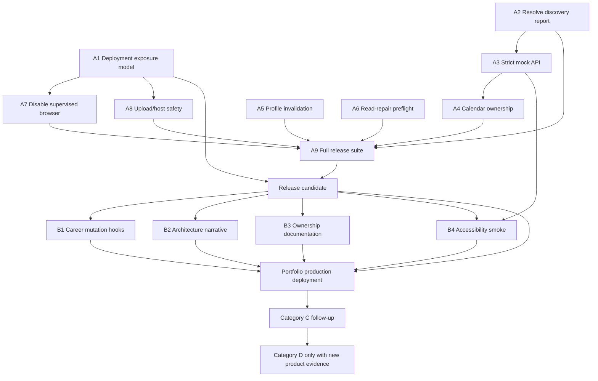

# Phase 2 Portfolio-Readiness Cleanup Plan

**Branch:** `release/portfolio-readiness`  
**Plan date:** 2026-07-26  
**Inputs:**

- `docs/architecture/phase-2-architecture-inventory.md`
- `docs/architecture/phase-2-frontend-audit.md`
- `docs/architecture/phase-2-backend-audit.md`
- `docs/architecture/phase-2-contract-audit.md`

**Constraint:** This is a bounded cleanup and deployment plan. It is not authorization for a rewrite, product expansion, file migration, or framework change.

## Executive recommendation

Complete a limited pre-deployment cleanup and then deploy.

Deploying immediately would knowingly ship an active frontend query whose backend endpoint does not exist, while the browser mocks conceal the 404. It would also leave submission/Calendar ownership ambiguous and allow profile mutations to display stale derived state. At the other extreme, resolving every architecture concern before deployment would delay the portfolio release for low-value reorganizations.

The recommended release strategy is:

1. define a safe portfolio deployment mode;
2. complete the bounded Category A contract/correctness gates;
3. run the full verification gate;
4. deploy;
5. complete Category B only where it materially improves the presentation narrative without destabilizing the release;
6. track Category C after deployment and keep Category D explicitly out of scope.

## Verified high-severity source findings

The highest-severity audit claims were rechecked directly before inclusion:

| Finding | Direct source verification | Planning result |
|---|---|---|
| Missing discovery-report route | `frontend/src/features/breakdowns/api/index.ts:getDiscoveryReport` calls `/automation/discovery/report`; `useDiscoveryReport` is mounted by `BreakdownDiscovery`; no route decorator exists in `backend/app/api/v1/routes/automation.py` | Category A |
| Catch-all Playwright success | `frontend/e2e/support/mockApi.ts:handle` falls through to `defaultResponse`, which returns successful `[]`/`null` data | Category A |
| Submission/Calendar conflict | `SubmissionService.create` calls `WorkflowConnectorService.after_submission_created`, which creates Calendar events; `useSubmissionTracker.createAuditionLinkedRecords` can then POST a second event through `OperationsService.create_event`, which does not deduplicate | Category A |
| Profile invalidation gap | `ActorProfileService.create_or_replace/update` recomputes every non-demo opportunity; `useUpdateActorProfile` invalidates only `profileKeys.actor` | Category A |
| Platform-import invalidation gap | `PlatformImportService.approve_profile` creates credits and mutates actor skills; `useInvalidateImports` omits actor and derived-fit query owners | Category A |
| Opportunity GET/list writes | `OpportunityService.list/get` may repair roles/trust/details/visibility and call `db.commit()` | Category A operational constraint; full removal deferred |
| Process-global browser | `supervised_browser = SupervisedBrowserController()` is module-global in `supervised_breakdown_import_service.py` | Category A deployment constraint |
| No authentication boundary | no auth/security dependency exists in `backend/app`; `main.py` mounts all v1 routes; README lists authentication as future work | Category A deployment-mode decision; full auth is Category D unless live private data is deployed |
| Career presentation calls APIs directly | `CareerIntelligencePanel.tsx` and `CareerLegacyPanels.tsx` await Career API functions without mutation hooks | Category B |
| Silent list caps | `BaseRepository.list` and `OpportunityRepository.search` cap at 100 while routes return bare arrays | Category C unless the portfolio dataset approaches the limit |

## Scope rules

A task belongs in Category A only if its acceptance criteria can be completed without a broad architecture migration and it protects production correctness, security, data integrity, deployment stability, API compatibility, or a broken workflow.

“Before frontend deployment” means before publishing a frontend that communicates with a remotely reachable instance of this backend. A static screenshot/demo build that never exposes the backend is a different deployment mode and must be documented as such.

# A. Must fix before frontend deployment

## A1. Define and enforce the portfolio deployment exposure model

- **Problem:** the backend has no authentication, authorization, tenant isolation, or per-user ownership. `backend/app/main.py` exposes the entire v1 API, including mutations, imports, personal profile data, local file access, and automation controls. `README.md` lists authentication as future work.
- **Evidence and file paths:**
  - `backend/app/main.py`
  - `backend/app/api/v1/router.py`
  - `backend/app/core/config.py`
  - `README.md` authentication/production-roadmap sections
  - no authentication dependency or middleware under `backend/app`
- **Proposed scope:** choose and implement one bounded release posture:
  1. preferred for this phase: sanitized single-actor portfolio/demo data, no private records, external integrations disabled, supervised browser disabled, explicit demo-mode banner/README, and backend access restricted by hosting controls where available; or
  2. if live/private data must be reachable: stop this cleanup phase and open a separate authentication/authorization project before deployment.
- **Out of scope:** multi-tenant account design, social login, roles/permissions, subscription billing, or a new identity platform as part of Phase 2.
- **Acceptance criteria:**
  - deployment mode and data classification are documented;
  - no real personal/private actor data is seeded into a public unauthenticated instance;
  - production environment rejects or disables unsupported automation/import surfaces;
  - CORS is restricted to the deployed frontend origin;
  - external providers default off and secrets are supplied only through environment configuration;
  - a reviewer can tell whether the site is a demo or authenticated product.
- **Tests to run or add:** configuration tests for production CORS and disabled capabilities; deployment smoke for `/health`, read routes, and blocked/disabled risky routes.
- **Estimated risk:** high.
- **Dependencies:** deployment-host decision; precedes every public deployment.
- **Separate commit required:** yes, for configuration/documentation enforcement.
- **Separate GitHub Issue appropriate:** yes. If live data/authentication is required, create a separate epic rather than expanding this task.

## A2. Resolve the broken discovery-report contract

- **Problem:** the Breakdowns UI actively requests a route that FastAPI does not provide.
- **Evidence and file paths:**
  - `frontend/src/features/breakdowns/api/index.ts:getDiscoveryReport`
  - `frontend/src/features/breakdowns/hooks/useBreakdownQueries.ts:useDiscoveryReport`
  - `frontend/src/features/breakdowns/components/BreakdownDiscovery.tsx`
  - `backend/app/api/v1/routes/automation.py`
  - `backend/app/automation/discovery/service.py:_discovery_report`
- **Proposed scope:** decide from current product behavior whether a report exists only as part of `runBreakdownDiscovery` or should be a persisted/latest read. The smallest likely fix is to remove the standalone query and render the mutation result unless there is already durable report data.
- **Out of scope:** new discovery analytics storage, report history, dashboards, or discovery-service restructuring.
- **Acceptance criteria:**
  - every Breakdowns query maps to a registered backend endpoint;
  - initial Breakdowns load has no 404;
  - discovery results still render after a run;
  - empty/loading/error states are explicit;
  - frontend and backend tests agree on the chosen ownership.
- **Tests to run or add:** frontend API/hook/component tests; a route-inventory assertion; Breakdowns Playwright flow; backend contract smoke if an endpoint is added.
- **Estimated risk:** medium.
- **Dependencies:** none.
- **Separate commit required:** yes.
- **Separate GitHub Issue appropriate:** no; bounded release fix.

## A3. Make unhandled mock API calls fail

- **Problem:** the Playwright mock returns successful default data for unsupported or misspelled endpoints and masked A2.
- **Evidence and file paths:**
  - `frontend/e2e/support/mockApi.ts:installMockApi`
  - `frontend/e2e/support/mockApi.ts:handle`
  - `frontend/e2e/support/mockApi.ts:defaultResponse`
  - `frontend/e2e/request-graphs.spec.ts`
  - `frontend/e2e/cross-feature.spec.ts`
- **Proposed scope:** replace catch-all success with an explicit unhandled-route failure. Add explicit handlers for routes intentionally used by the covered browser flows. Correct only fixture fields encountered by those flows.
- **Out of scope:** reproducing all backend logic in TypeScript, generating a mock server, or replacing Playwright.
- **Acceptance criteria:**
  - every request in the Playwright suite is handled intentionally;
  - an unknown path or wrong method fails the test with method/path context;
  - the missing-report regression would fail;
  - existing request recording and deterministic failure/delay controls remain available.
- **Tests to run or add:** all Playwright tests; focused test proving an unknown route fails; frontend build/typecheck.
- **Estimated risk:** medium because it can reveal latent mock gaps.
- **Dependencies:** complete after or alongside A2 so the known orphan has an intentional resolution.
- **Separate commit required:** yes.
- **Separate GitHub Issue appropriate:** no.

## A4. Establish one submission-to-Calendar owner

- **Problem:** backend submission creation can create Calendar events automatically, while the frontend exposes an opt-in checkbox and may create another persisted event.
- **Evidence and file paths:**
  - `frontend/src/features/auditions/hooks/useSubmissionTracker.ts:submit`, `createAuditionLinkedRecords`
  - `frontend/src/features/auditions/types/index.ts:SubmissionFormState`
  - `frontend/src/features/auditions/api/index.ts:createCalendarEvent`
  - `backend/app/services/submission_service.py:SubmissionService.create`
  - `backend/app/services/workflow_connector_service.py:after_submission_created`, `_ensure_calendar_events`
  - `backend/app/services/operations_service.py:create_event`
  - `backend/tests/test_cross_module_workflows.py`
  - `frontend/e2e/cross-feature.spec.ts`
- **Proposed scope:** first add a real PostgreSQL characterization for checked-equivalent and unchecked-equivalent flows. Then choose one owner:
  - backend policy with frontend copy reflecting automatic creation; or
  - an explicit typed submission option honored by the backend.
  Preserve idempotency and existing Calendar projection behavior.
- **Out of scope:** Calendar redesign, event-series support, background synchronization, or changing unrelated submission side effects.
- **Acceptance criteria:**
  - one submission creates at most one event per intended event type/instant;
  - the UI opt-in accurately controls or describes behavior;
  - retrying does not duplicate events;
  - direct Calendar creation remains supported;
  - cross-feature invalidation matches the chosen behavior.
- **Tests to run or add:** real PostgreSQL contract tests for on/off/retry; `test_cross_module_workflows.py`; Auditions hook/component tests; `cross-feature.spec.ts`; request-graph tests.
- **Estimated risk:** high.
- **Dependencies:** A3 for trustworthy E2E behavior.
- **Separate commit required:** yes.
- **Separate GitHub Issue appropriate:** yes because it spans frontend, backend, contract tests, and a product-semantic decision.

## A5. Add profile and platform-import invalidation contracts

- **Problem:** successful backend mutations change actor/opportunity/credit state beyond the frontend caches currently invalidated.
- **Evidence and file paths:**
  - `frontend/src/features/profile/hooks/useProfileQueries.ts:useUpdateActorProfile`, `useInvalidateImports`, `usePlatformImportAction`
  - `frontend/src/services/api/invalidationContracts.ts`
  - `backend/app/services/actor_profile_service.py:_refresh_breakdown_eligibility`
  - `backend/app/services/workflow_connector_service.py:profile_changed`
  - `backend/app/services/platform_import_service.py:approve_profile`, `_create_credits_from_parsed`, `_apply_skills_to_actor`
- **Proposed scope:** add named invalidation contracts for actor-profile update and actor-linked platform-profile approval. Invalidate only proven owners: actor, credits/import state, opportunity visible/hidden/readiness/material matches, and any command-center/analytics read proven to consume the changed fields.
- **Out of scope:** consolidating Profile and Materials APIs, moving types, or rewriting Profile components.
- **Acceptance criteria:**
  - profile edits immediately refresh affected opportunity/readiness views;
  - approved imported skills immediately appear in Profile;
  - public-profile approval that only creates mappings does not trigger unrelated broad refetches;
  - failed mutations invalidate nothing;
  - exact direct/derived/forbidden owners are documented and tested.
- **Tests to run or add:** `invalidationContracts.test.ts`; `useProfileQueries.test.tsx`; backend actor eligibility and platform-import tests; focused cross-feature Playwright request graph.
- **Estimated risk:** medium.
- **Dependencies:** none; use the established invalidation-contract pattern.
- **Separate commit required:** yes.
- **Separate GitHub Issue appropriate:** no.

## A6. Constrain read-side opportunity repair before remote deployment

- **Problem:** `GET /opportunities` and `GET /opportunities/{id}` can change visibility, add children/metadata, and commit. Removing this immediately could strand legacy rows; leaving it undocumented requires write-capable GETs and creates operational surprises.
- **Evidence and file paths:**
  - `backend/app/services/opportunity_service.py:OpportunityService.list`, `get`
  - `backend/app/services/breakdown_deadline_service.py`
  - `backend/app/services/trust_verification_service.py`
  - `backend/app/services/breakdown_role_service.py`
  - `backend/app/services/character_intelligence_engine.py`
  - migrations 0023-0032 and 0039-0048
- **Proposed scope:** characterize the legacy rows that need repair; create a one-shot, idempotent pre-deployment repair/preflight; prove a current fully migrated dataset does not write during ordinary GETs. Retain a compatibility fallback only if evidence shows it is still necessary and document it.
- **Out of scope:** a new read-model architecture, event sourcing, repository rewrite, or broad service split.
- **Acceptance criteria:**
  - an explicit preflight can identify/repair stale rows safely;
  - current portfolio seed/data passes the preflight;
  - a contract test detects writes during a normal current-row GET;
  - deployment documentation states whether GET still requires write access;
  - no visibility or child-record regression.
- **Tests to run or add:** focused GET-purity/legacy-repair contract tests; opportunity create/deep-parse/eligibility/trust contract suite; full backend contract smoke.
- **Estimated risk:** high.
- **Dependencies:** database backup and final migrated test schema.
- **Separate commit required:** yes.
- **Separate GitHub Issue appropriate:** yes; the compatibility decision and data preflight deserve an auditable issue.

## A7. Disable process-global supervised browser behavior in production

- **Problem:** one module-global headful Playwright browser/page is shared across all requests and cannot safely support a remote multi-user or multi-worker server.
- **Evidence and file paths:**
  - `backend/app/services/supervised_breakdown_import_service.py:SupervisedBrowserController`, `supervised_browser`
  - `backend/app/api/v1/routes/supervised_breakdowns.py`
  - `backend/app/core/config.py`
- **Proposed scope:** gate start/capture/status/close behind an explicit local-development capability. In portfolio production, return a stable unavailable response or omit/disable the UI entry point while retaining supervised import records and manual alternatives.
- **Out of scope:** remote browser farms, session ownership, queues, or distributed Playwright.
- **Acceptance criteria:**
  - production configuration cannot launch a headful browser;
  - capability output and UI accurately report unavailability and fallback;
  - local development behavior remains testable;
  - no process-global browser state is exposed remotely.
- **Tests to run or add:** capability/config tests; route test for production-disabled behavior; supervised-import local-mode tests.
- **Estimated risk:** low-to-medium.
- **Dependencies:** A1 deployment mode.
- **Separate commit required:** yes.
- **Separate GitHub Issue appropriate:** no; distributed replacement belongs in Category D.

## A8. Make local upload failure behavior safe for the chosen host

- **Problem:** files can be orphaned when database work fails after `save_upload`; file deletion occurs after database commit; local paths assume one persistent host.
- **Evidence and file paths:**
  - `backend/app/services/file_storage_service.py`
  - `backend/app/services/asset_service.py:create`, `delete`
  - `backend/app/services/platform_import_service.py:import_from_upload`
  - `backend/app/services/resume_pdf_service.py`
  - `backend/app/core/config.py:upload_dir`
- **Proposed scope:** confirm whether the selected host provides persistent local storage. Add compensation for asset-create failure and observable handling for delete failure. Disable upload/import surfaces if persistence is unavailable.
- **Out of scope:** object-storage migration unless the chosen host requires it; CDN, media processing, or asset redesign.
- **Acceptance criteria:**
  - failed asset database creation removes the newly written file;
  - failed file deletion is logged/recoverable and does not misreport success silently;
  - upload persistence expectations are documented and verified on the chosen host;
  - no destructive cleanup targets broad directories.
- **Tests to run or add:** temporary-directory create/rollback/delete tests; asset/material tests; backend contract smoke.
- **Estimated risk:** medium.
- **Dependencies:** A1 hosting decision.
- **Separate commit required:** yes.
- **Separate GitHub Issue appropriate:** yes if object storage is required; otherwise no.

## A9. Resolve the known verification-suite failure and enforce the release suite

- **Problem:** the Phase 1 baseline recorded a repeatable Playwright failure for Calendar immediate-return refetch, and current CI omits several locally passing checks.
- **Evidence and file paths:**
  - `frontend/e2e/request-graphs.spec.ts`
  - `frontend/src/services/api/queryPolicy.ts`
  - `frontend/src/services/api/queryPolicyInventory.ts`
  - `.github/workflows/frontend-playwright.yml`
  - `.github/workflows/backend-contract-smoke.yml`
  - baseline results in `phase-2-architecture-inventory.md`
- **Proposed scope:** decide whether the immediate-return expectation or implementation is correct, make the single bounded correction, and establish a documented/CI release sequence covering frontend unit/lint/build/typecheck/Playwright and backend fast tests/Ruff/contract smoke.
- **Out of scope:** zero-warning perfection outside configured rules, CI-provider migration, performance benchmarking, or unrelated flaky-test rewrites.
- **Acceptance criteria:**
  - no unexplained failing required test;
  - the Calendar freshness contract and observed request graph agree;
  - all standard checks run in CI or have an explicit documented local gate;
  - external providers are disabled during deterministic tests;
  - contract database safety guards remain intact.
- **Tests to run or add:** the full deployment gate listed later in this document.
- **Estimated risk:** medium.
- **Dependencies:** A2-A5 and A7 where their tests alter request graphs/capabilities.
- **Separate commit required:** yes; CI/test-policy changes should not be mixed with production fixes.
- **Separate GitHub Issue appropriate:** no unless the Calendar failure proves non-local.

# B. High-value cleanup before portfolio presentation

These tasks improve the architecture story and reviewer confidence. They should be completed only after Category A is green and should not delay deployment if they become risky.

## B1. Route Career commands through mutation hooks

- **Problem:** Career presentation components call API functions directly and own network result state.
- **Evidence and file paths:**
  - `frontend/src/features/career-intelligence/components/CareerIntelligencePanel.tsx:CareerPathSimulatorSection`
  - `frontend/src/features/career-intelligence/components/CareerLegacyPanels.tsx:AIIntelligencePanel`
  - `frontend/src/features/career-intelligence/api/index.ts`
  - `frontend/src/features/career-intelligence/hooks/useCareerQueries.ts`
- **Proposed scope:** add canonical mutation hooks for simulation, opportunity preparation, and material-plan creation; preserve current layout and ephemeral displayed results.
- **Out of scope:** splitting the full Career panel, redesigning Career, or moving all local UI state into TanStack Query.
- **Acceptance criteria:** presentation modules no longer await raw API functions; pending/error behavior is visible; cache effects are explicit; focused tests cover success/error.
- **Tests to run or add:** Career hook tests, focused component tests, frontend unit/lint/build/typecheck.
- **Estimated risk:** medium.
- **Dependencies:** Category A green.
- **Separate commit required:** yes.
- **Separate GitHub Issue appropriate:** no.

## B2. Publish the verified architecture and deployment narrative

- **Problem:** the code contains strong boundaries and deliberate constraints, but reviewers must infer them from tests and historical notes.
- **Evidence and file paths:**
  - all four Phase 2 audits
  - `README.md`
  - `frontend/src/services/api/invalidationContracts.ts`
  - `frontend/src/features/breakdowns/ARCHITECTURE.md`
  - backend contract-smoke safety guards
- **Proposed scope:** update README/architecture documentation with entry points, request flow, server-state ownership, deterministic-agent status, approval gates, demo limitations, deployment mode, and standard verification commands.
- **Out of scope:** marketing rewrite, screenshots/design overhaul, or claiming unimplemented authentication/AI/automation.
- **Acceptance criteria:** a recruiter can identify frontend/backend entry points, major domains, testing layers, deployment limitations, and verification commands in minutes; claims match code.
- **Tests to run or add:** link/path validation; markdown review; no runtime tests beyond the release gate.
- **Estimated risk:** low.
- **Dependencies:** A1 and A9 decisions.
- **Separate commit required:** yes, documentation-only.
- **Separate GitHub Issue appropriate:** no.

## B3. Document public feature APIs and backend transaction ownership

- **Problem:** frontend barrels expose broad raw APIs and backend public methods do not declare whether they commit.
- **Evidence and file paths:**
  - `frontend/src/features/*/index.ts`
  - `frontend/eslint.config.js`
  - `backend/app/services/*`
  - `backend/app/agents/*`
  - `backend/app/automation/discovery/service.py`
- **Proposed scope:** add concise ownership/transaction documentation and explicit export intent for the broadest features (Career, Profile, Breakdowns). Remove no public symbol unless proven unused.
- **Out of scope:** converting all barrels, universal repositories, unit-of-work framework, or moving files.
- **Acceptance criteria:** contributors can tell which frontend exports are cross-feature contracts and which backend methods commit versus require caller commit; discovery’s transaction owner remains explicit.
- **Tests to run or add:** existing architecture tests, lint, backend tests; documentation review.
- **Estimated risk:** low.
- **Dependencies:** A6 transaction/read conclusions.
- **Separate commit required:** yes, documentation/low-risk boundary clarification.
- **Separate GitHub Issue appropriate:** no.

## B4. Add a small accessibility smoke gate

- **Problem:** semantic and focus behavior is tested selectively, but there is no systematic accessibility smoke check for the portfolio’s most visible workflows.
- **Evidence and file paths:**
  - `frontend/src/components/ui.tsx`
  - `frontend/src/layout/TopNavigation.tsx`
  - Dashboard, Profile, Breakdowns, and Calendar component tests
  - `frontend/e2e/*`
- **Proposed scope:** add a small automated scan/keyboard smoke for the shell, one representative form, Dashboard customization, and Calendar; fix only high-impact failures found.
- **Out of scope:** full WCAG certification, global visual redesign, or rewriting third-party Calendar internals.
- **Acceptance criteria:** no critical automated violations on selected routes; primary navigation and representative forms work by keyboard; known third-party limitations are documented.
- **Tests to run or add:** focused accessibility/Playwright suite plus existing frontend checks.
- **Estimated risk:** low-to-medium.
- **Dependencies:** A3 strict mock handling and stable deployment routes.
- **Separate commit required:** yes.
- **Separate GitHub Issue appropriate:** yes if remediation expands beyond the bounded smoke set.

# C. Safe follow-up cleanup after deployment

## C1. Tighten contract schemas, errors, mocks, and list completeness incrementally

- **Problem:** several frontend-consumed dictionary endpoints lack response models; structured errors are flattened; mock fixtures drift; selected lists silently cap at 100.
- **Evidence and file paths:**
  - `backend/app/api/v1/routes/system.py`
  - `backend/app/api/v1/routes/intelligence.py:get_material_performance`
  - `backend/app/api/v1/routes/automation.py:recalculate_travel_exceptions`
  - `backend/app/api/v1/routes/command_center.py:resolve_outcome_nudge`
  - `frontend/src/services/api/request.ts`
  - `frontend/e2e/support/mockApi.ts`
  - `backend/app/repositories/base.py`, `opportunity.py`, `asset.py`
- **Proposed scope:** one endpoint family at a time: add response models without JSON changes, preserve error codes/field errors, type representative fixtures, and choose explicit pagination or complete bounded lists.
- **Out of scope:** generated-client migration or API version rewrite.
- **Acceptance criteria:** each touched endpoint has matching Pydantic/TypeScript/test contracts; pagination semantics are explicit before data exceeds current bounds.
- **Tests to run or add:** request parser tests, OpenAPI/contract smoke, typed fixture checks, >100-row characterization.
- **Estimated risk:** medium.
- **Dependencies:** deployed baseline and usage data.
- **Separate commit required:** yes per endpoint family.
- **Separate GitHub Issue appropriate:** yes; split into response/error/pagination sub-issues.

## C2. Consolidate duplicated endpoint ownership

- **Problem:** Profile and Materials duplicate platform import/mapping functions; Career and Script Finder duplicate material-plan creation.
- **Evidence and file paths:**
  - `frontend/src/features/profile/api/index.ts`
  - `frontend/src/features/materials/api/index.ts`
  - `frontend/src/features/career-intelligence/api/index.ts`
  - `frontend/src/features/script-finder/api/index.ts`
- **Proposed scope:** choose one frontend feature owner per backend resource and expose narrow public hooks/types to consumers.
- **Out of scope:** changing backend URLs, merging features, or redesigning workflows.
- **Acceptance criteria:** one transport definition and invalidation policy per resource; current UI behavior preserved.
- **Tests to run or add:** feature hook tests, invalidation tests, cross-feature Playwright, build/lint.
- **Estimated risk:** medium.
- **Dependencies:** A5 and B1 establish correct mutation ownership first.
- **Separate commit required:** yes per resource family.
- **Separate GitHub Issue appropriate:** yes.

## C3. Reduce large modules only through characterized seams

- **Problem:** several frontend and backend files combine many responsibilities.
- **Evidence and file paths:**
  - `frontend/src/features/breakdowns/components/BreakdownDetails.tsx`
  - `CareerIntelligencePanel.tsx`
  - `DashboardPanel.tsx`
  - `SourceLibraryPanel.tsx`
  - `backend/app/services/intelligence_service.py`
  - `backend/app/automation/discovery/service.py`
  - `backend/app/services/source_research_service.py`
- **Proposed scope:** extract one pure selector, external adapter, or route-private workflow at a time only when a nearby behavior change supplies characterization.
- **Out of scope:** size-driven splitting, folder redesign, or a “clean architecture” rewrite.
- **Acceptance criteria:** each extraction has a narrower contract, unchanged request/transaction behavior, and equal or better tests.
- **Tests to run or add:** feature-specific characterization plus full relevant suite.
- **Estimated risk:** medium-to-high.
- **Dependencies:** deployed stable baseline; follow existing Breakdowns preflight.
- **Separate commit required:** yes per extraction.
- **Separate GitHub Issue appropriate:** yes only for a concrete seam, never “split large files.”

## C4. Migrate types and public barrels incrementally

- **Problem:** `frontend/src/types/domain.ts` is 1,381 lines; feature barrels export more than consumers need; some aliases/duplicates obscure ownership.
- **Evidence and file paths:**
  - `frontend/src/types/domain.ts`
  - `frontend/src/features/*/types/index.ts`
  - `frontend/src/features/*/index.ts`
  - duplicated `DiscoveryMode`
- **Proposed scope:** move one stable resource family during adjacent work, maintain compatibility exports, and replace one wildcard barrel with explicit exports after consumer inventory.
- **Out of scope:** moving all types/barrels in one branch.
- **Acceptance criteria:** no cross-feature internal imports; compatibility preserved; ownership clearer for the touched resource.
- **Tests to run or add:** TypeScript, lint architecture rule, unit/build.
- **Estimated risk:** medium if bounded, high if broad.
- **Dependencies:** C2 ownership decisions.
- **Separate commit required:** yes per family.
- **Separate GitHub Issue appropriate:** yes for each bounded family, not one global issue.

## C5. Clarify backend transaction and persistence boundaries opportunistically

- **Problem:** routes, services, and agents commit inconsistently; repositories are selective; agents combine calculation and persistence.
- **Evidence and file paths:**
  - `backend/app/api/v1/routes/agents.py`, `career_development.py`, `travel_preferences.py`, `command_center.py`
  - `backend/app/services/*`
  - `backend/app/agents/*`
  - `backend/app/repositories/*`
- **Proposed scope:** when changing a composed workflow, add a non-committing internal method and preserve the committing wrapper. Move domain constants out of repository modules when touched.
- **Out of scope:** universal repositories, a global unit-of-work framework, or changing every commit site.
- **Acceptance criteria:** the touched workflow has one documented commit owner and rollback characterization.
- **Tests to run or add:** focused commit-count/rollback contract tests and full backend tests.
- **Estimated risk:** high for each transaction change.
- **Dependencies:** A6 and stable deployment data.
- **Separate commit required:** yes per workflow.
- **Separate GitHub Issue appropriate:** yes for each specific workflow.

## C6. Retire proven-dead compatibility surfaces and naming ambiguity

- **Problem:** unused layout wrappers/aliases, a broken dormant travel helper, `utils`/`utilities`, legacy names, and candidate orphan endpoints add noise.
- **Evidence and file paths:**
  - `frontend/src/components/layouts/*`
  - `frontend/src/utilities/index.ts`
  - `frontend/src/features/profile/api/index.ts:updateTravelPreferences`
  - `CareerLegacyPanels.tsx`
  - backend orphan candidates listed in `phase-2-contract-audit.md`
- **Proposed scope:** remove or rename one proven-unused surface at a time after source search and runtime/access-log verification.
- **Out of scope:** route renaming across the app or deleting planned/manual endpoints based only on frontend search.
- **Acceptance criteria:** each removal has no callers and passes all checks; compatibility aliases remain where consumers exist.
- **Tests to run or add:** `rg`, TypeScript, lint, build, route/contract smoke.
- **Estimated risk:** low per verified item.
- **Dependencies:** deployed usage evidence for backend endpoints.
- **Separate commit required:** yes; group only closely related dead surfaces.
- **Separate GitHub Issue appropriate:** usually no.

# D. Explicitly deferred product expansion

## D1. Full authentication, accounts, and multi-tenancy

- **Problem:** required for a real private multi-user product, but too large for a cleanup phase.
- **Evidence and file paths:** `README.md` roadmap; absence of auth in `backend/app`; actor-owned tables throughout `backend/app/db/models`.
- **Proposed scope:** separate future product project covering identity, ownership, authorization, migration, and threat modeling.
- **Out of scope:** all implementation in Phase 2. A1 must keep the portfolio release sanitized/restricted instead.
- **Acceptance criteria:** not applicable to this cleanup; issue has explicit product requirements before implementation.
- **Tests to run or add:** future authorization matrix and tenant-isolation contract tests.
- **Estimated risk:** high.
- **Dependencies:** product/hosting decision.
- **Separate commit required:** multiple future commits.
- **Separate GitHub Issue appropriate:** yes, as an epic.

## D2. Durable job workers and async orchestration

- **Problem:** long-running discovery/import/intelligence work may eventually exceed request boundaries.
- **Evidence and file paths:** sync routes and external calls in discovery, source research, travel, imports, and intelligence services.
- **Proposed scope:** future job state, idempotency, worker lifecycle, and observability design.
- **Out of scope:** changing handlers to `async def` while retaining blocking work, or adding a queue before hosting requirements exist.
- **Acceptance criteria:** future design must survive retries/restarts and preserve current transaction contracts.
- **Tests to run or add:** future job idempotency, restart, timeout, and failure recovery.
- **Estimated risk:** high.
- **Dependencies:** measured production workload.
- **Separate commit required:** multiple.
- **Separate GitHub Issue appropriate:** yes.

## D3. Real submission automation or distributed supervised browsers

- **Problem:** current submission adapters are deliberately mock-only and supervised browsing is local/manual.
- **Evidence and file paths:**
  - `backend/app/automation/playwright/service.py`
  - `backend/app/automation/submission/adapters.py`
  - `backend/app/services/supervised_breakdown_import_service.py`
- **Proposed scope:** future terms/safety review, per-user sessions, credentials, approval, audit, and remote browser infrastructure.
- **Out of scope:** Phase 2 and the portfolio release.
- **Acceptance criteria:** future product requirements must precede implementation.
- **Tests to run or add:** future safety, approval, isolation, retry, and provider contract suites.
- **Estimated risk:** high.
- **Dependencies:** authentication and legal/provider review.
- **Separate commit required:** multiple.
- **Separate GitHub Issue appropriate:** yes, as an epic.

## D4. LLM integration and new agent capabilities

- **Problem:** prompts/config imply future AI integration, but agents are currently deterministic and testable.
- **Evidence and file paths:** `backend/app/agents/*`, `backend/app/prompts/*`, `backend/app/core/config.py:openai_api_key`.
- **Proposed scope:** future model policy, structured outputs, evaluation, cost, privacy, fallback, and observability.
- **Out of scope:** adding an LLM merely to make the portfolio appear more AI-heavy.
- **Acceptance criteria:** future implementation must retain deterministic fallbacks and evaluations.
- **Tests to run or add:** future contract/evaluation/privacy tests.
- **Estimated risk:** high.
- **Dependencies:** product need and privacy policy.
- **Separate commit required:** multiple.
- **Separate GitHub Issue appropriate:** yes.

## D5. Major UI, state-management, API-client, or persistence redesign

- **Problem:** fashionable alternatives exist, but current React Router/TanStack Query/Vite/FastAPI/SQLAlchemy patterns are working and tested.
- **Evidence and file paths:** frontend provider/query architecture, architecture tests, backend contract tests, all Phase 2 audits.
- **Proposed scope:** none without measured failure.
- **Out of scope:** Redux/Zustand introduction, generated-client migration, universal repository layer, event sourcing, microservices, broad folder moves, and full design-system rewrite.
- **Acceptance criteria:** do not open implementation work without a concrete production problem and migration plan.
- **Tests to run or add:** not applicable.
- **Estimated risk:** high.
- **Dependencies:** demonstrated need.
- **Separate commit required:** future project.
- **Separate GitHub Issue appropriate:** no speculative issue; create only when evidence exists.

# Recommended execution order

1. **A1 — Deployment exposure model.** This determines which backend capabilities may be reachable.
2. **A2 — Discovery-report contract.**
3. **A3 — Strict mock handling.** Run immediately after A2 so all current calls are intentional.
4. **A4 — Submission/Calendar ownership.**
5. **A5 — Profile/import invalidation contracts.**
6. **A7 — Disable production supervised browser.**
7. **A8 — Upload/host safety.**
8. **A6 — Opportunity read repair preflight and purity characterization.**
9. **A9 — Resolve verification failure and enforce the complete release suite.**
10. **Deploy a release candidate and run smoke checks.**
11. **B1-B4 only if the release candidate remains stable and the presentation date allows.**
12. **Deploy production.**
13. **Track Category C from actual usage; keep Category D deferred.**

# Dependency graph

B1, B3, and B4 are optional before production; their arrows indicate sequencing if selected, not mandatory deployment dependencies.

# Suggested commit boundaries

No commit should mix unrelated architecture cleanup. Suggested boundaries:

1. `fix(contract): resolve breakdown discovery report ownership`
2. `test(e2e): fail unhandled mock API requests`
3. `fix(auditions): establish single submission calendar owner`
4. `fix(profile): align invalidation with profile and import side effects`
5. `chore(deploy): enforce demo-mode capability and CORS constraints`
6. `fix(storage): compensate failed local asset writes`
7. `fix(opportunities): add legacy repair preflight and read-purity contract`
8. `ci: enforce portfolio readiness verification suite`
9. `refactor(career): route commands through mutation hooks`
10. `docs: publish architecture and deployment narrative`
11. `test(a11y): add portfolio route accessibility smoke`

Each commit must be independently green for its affected suite. A4 and A6 must not be combined with presentation refactors because their rollback/data behavior is high risk.

# Suggested GitHub Issue titles

Create issues only for work with a decision, cross-stack coordination, operational follow-up, or meaningful post-deployment scope:

1. `Define the sanitized portfolio deployment and API exposure model`
2. `Establish one authoritative submission-to-Calendar contract`
3. `Characterize and retire opportunity repair-on-read behavior`
4. `Verify persistent upload storage and orphan-file compensation`
5. `Add a bounded accessibility smoke gate for portfolio routes`
6. `Consolidate platform import and asset-mapping frontend ownership`
7. `Consolidate material-plan lifecycle ownership`
8. `Add explicit response/error contracts to dictionary endpoints`
9. `Define pagination semantics for opportunities and assets`
10. `Future epic: authentication, authorization, and tenant isolation`
11. `Future epic: durable jobs for discovery and imports`
12. `Future epic: safe remote browser and submission automation`

Do not create vague issues such as “clean architecture,” “split large files,” “improve types,” or “refactor backend.”

# Deployment gate checklist

## Repository and build

- [ ] Branch is `release/portfolio-readiness`.
- [ ] Working tree contains only reviewed release changes.
- [ ] Frontend unit tests pass.
- [ ] Frontend lint passes.
- [ ] Frontend TypeScript check passes.
- [ ] Frontend production build passes.
- [ ] Full Playwright suite passes with strict unhandled-route behavior.
- [ ] Backend fast tests pass.
- [ ] Backend Ruff lint/format checks pass or have a narrowly documented approved baseline.
- [ ] Backend contract-smoke suite passes against disposable PostgreSQL.
- [ ] Alembic upgrades from zero to head successfully.

## Contract correctness

- [ ] No frontend request targets an unregistered backend route.
- [ ] Discovery report has one defined owner and empty state.
- [ ] Submission/Calendar opt-in and deduplication are contract tested.
- [ ] Profile/import mutations invalidate every proven owner and no forbidden owner.
- [ ] Calendar immediate-return freshness policy matches observed behavior.
- [ ] Unknown Playwright API requests fail tests.
- [ ] Required production response shapes are represented by either Pydantic schemas or contract tests.

## Data and operational safety

- [ ] Production/demo dataset is sanitized and backed up.
- [ ] Opportunity legacy-repair preflight passes.
- [ ] Ordinary current-row opportunity GET behavior is characterized.
- [ ] Upload storage persists on the chosen host or uploads are disabled.
- [ ] Failed upload writes are compensated.
- [ ] Supervised browser is disabled remotely.
- [ ] Real external discovery/travel/AI providers are disabled unless deliberately configured and tested.
- [ ] No destructive test can target a non-test database.

## Security and deployment exposure

- [ ] Deployment is explicitly demo-only/sanitized or authentication is completed as a separate prerequisite.
- [ ] CORS allows only the deployed frontend origin.
- [ ] Secrets are environment-provided and absent from repository/build output.
- [ ] Database and file endpoints are not exposed with real private data to anonymous users.
- [ ] Capability UI accurately labels unavailable/mock/manual integrations.
- [ ] HTTPS and host-level access controls are enabled where applicable.

## Portfolio presentation

- [ ] README describes actual architecture, deterministic agents, approval gates, tests, limitations, and deployment mode.
- [ ] Health endpoint and primary routes pass production smoke.
- [ ] Empty, loading, backend-unavailable, and error states are understandable.
- [ ] No console errors or failed API requests occur in the primary portfolio walkthrough.
- [ ] Demo data exercises the intended workflow without implying live automation or AI capabilities that do not exist.

# Audit findings that should not be acted on now

The following findings are valid observations but should not generate Phase 2 implementation work:

1. **Do not split every large file.** `BreakdownDetails`, Dashboard, discovery, and parsing engines have tested/intentional cohesion; extract only during adjacent characterized work.
2. **Do not split `frontend/src/types/domain.ts` wholesale.** Incremental feature ownership is safer after deployment.
3. **Do not replace TanStack Query or introduce Redux/Zustand.** Server-state ownership is already strong.
4. **Do not replace React Router, Vite, Tailwind, FastAPI, SQLAlchemy, or Alembic.**
5. **Do not introduce universal repositories.** Selective direct ORM access is pragmatic; document transaction ownership instead.
6. **Do not perform a broad async conversion.** Blocking calls inside `async def` would be worse; durable jobs require separate design.
7. **Do not rewrite migration history or move tables for folder symmetry.**
8. **Do not delete architecture source-text tests wholesale.** Replace brittle assertions only when an equivalent behavioral/import rule is added.
9. **Do not rename Opportunities/Breakdowns, Career legacy symbols, `utils`/`utilities`, or route namespaces globally before deployment.**
10. **Do not consolidate all frontend barrels at once.**
11. **Do not delete backend endpoint candidates based only on absence of frontend `api.*` calls.** URL helpers, scripts, manual flows, or planned clients may own them.
12. **Do not build real submission automation, remote browser infrastructure, LLM agents, notifications, or schedulers during cleanup.**
13. **Do not redesign Calendar or Dashboard interactions solely for architectural fashion.**
14. **Do not add generated API clients before stabilizing the current explicit contracts.**
15. **Do not attempt full authentication inside a small cleanup commit.** Either deploy sanitized/restricted demo mode or open a properly scoped prerequisite project.

# Final recommendation

**Complete a limited pre-deployment cleanup and then deploy.**

The minimum responsible release scope is A1-A9, with A6 limited to a preflight/purity characterization rather than an immediate broad rewrite. B1-B4 are valuable portfolio improvements but should be attempted only after the release candidate is green; B2 documentation is the strongest presentation return for the lowest risk.

This sequence produces a portfolio deployment with an honest security posture, no known broken API call, trustworthy E2E mocks, coherent Calendar behavior, correct cross-feature cache refresh, constrained operational hazards, and a reproducible verification gate—without turning Phase 2 into an indefinite architecture project.
